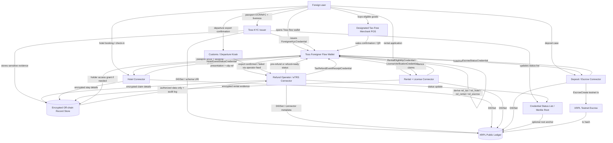

# Implementation Flow and Service Graph

This page translates the revised product direction into build phases. The core rule is: **connect existing actors, do not replace them**. For tax refunds, designated tax-free merchants, refund operators/eTRS, Customs, and tax authorities keep their current roles while the Toss wallet organizes proof, slips, and status receipts.

## 1.18 End-to-end Implementation Plan

### Phase 1 - Trust Anchor / Connector Setup

```yaml
tasks:
  - create XRPL account for each issuer or connector
  - create issuer/connector DID using DIDSet
  - publish DID document URI
  - publish credential schemas
  - publish trust metadata
  - create status-list service
  - create mock refund-operator/eTRS connector
```

Actors:

```yaml
actors:
  tossKycIssuer:
    role: passport/face/residence proof issuer
    credentialTypes:
      - ForeignerKycCredential

  taxRefundOperatorConnector:
    role: designated refund operator/eTRS integration or mock
    credentialTypes:
      - TaxRefundReadinessCredential
      - TaxRefundEventReceiptCredential
    doesNot:
      - approve refunds independently
      - replace customs export confirmation
      - submit tax settlement as Toss

  hotelPlatformConnector:
    role: hotel booking/check-in/deposit event integration
    credentialTypes:
      - HotelGuestStatusCredential

  rentalPlatformConnector:
    role: rental application/license-check event integration
    credentialTypes:
      - RentalEligibilityCredential
      - LicenseVerificationCredential

  escrowServiceConnector:
    role: hotel/rental deposit state or XRPL Testnet escrow demo
    credentialTypes:
      - EscrowStatusCredential

  trustRegistry:
    role: maps event types to authorized signer DIDs and licensed/partner status
    anchors:
      - trustPolicyHash
    maySyncWith:
      - registered tax-free merchant list
      - refund operator partner list
      - hotel/rental partner registry
```

---

### Phase 2 - Wallet Setup

```yaml
tasks:
  - create holder DID or holder keypair
  - create encrypted wallet store
  - create private identity graph
  - implement service-specific relationship ID derivation
  - support VC import/export
  - support verifiable presentation generation
  - support holder consent UI
  - support refund slip / QR / booking / license evidence import
```

Wallet storage:

```yaml
walletStorage:
  localDevice:
    encrypted: true
    stores:
      - holder keys
      - VCs
      - relationship IDs
      - private identity graph
      - reusable E0 passport/KYC anchor
      - tax refund slip references
      - hotel/rental/deposit receipt references

  cloudBackup:
    encrypted: true
    stores:
      - encrypted VCs
      - encrypted service receipts
      - encrypted identity graph
    shouldNotStore:
      - plaintext private keys
      - plaintext passport data
      - plaintext refund receipt detail
      - plaintext hotel or rental contract detail
```

---

### Phase 3 - Tax-Refund Streamlining

Use the current flow in [tax-refund-flow.mmd](../../current-context/tax-refund-flow.mmd) and [tax-refund-sequence.mmd](../../current-context/tax-refund-sequence.mmd) as the implementation baseline.

E0 is reusable. The wallet issues or imports `ForeignerKycCredential` once, then multiple purchase/refund chains branch from that same private anchor. Do not create one passport proof event per purchase.

#### 3-1. Immediate Refund

```text
1. Customer presents passport proof at a designated tax-free merchant.
2. Merchant POS checks immediate-refund conditions and limits.
3. POS/refund operator processes the tax-deducted purchase.
4. Toss wallet receives electronic sales confirmation or transaction receipt.
5. Wallet stores TaxRefundEventReceiptCredential(status=immediate_refund_completed).
```

Toss does not handle:

```yaml
doesNot:
  - POS approval
  - tax amount calculation
  - refund operator settlement
  - NTS reporting
```

#### 3-2. General Refund

```text
1. Customer pays the tax-included normal price.
2. Merchant issues sales confirmation / refund slip / QR.
3. Toss wallet imports the slip and creates purchase_record_registered event.
4. For downtown refund, user submits wallet presentation to refund operator.
5. Refund operator returns pre-refund/provisional state.
6. At departure, customer completes export confirmation at Customs/kiosk.
7. Refund operator receives export_confirmed or export_failed status.
8. Wallet stores payout_completed or refund_cancelled receipt.
```

Status enum:

```yaml
taxRefundStatuses:
  - purchase_record_registered
  - immediate_refund_completed
  - downtown_prerefunded
  - card_authorization_verified
  - refund_operator_accepted
  - airport_refund_ready
  - export_confirmation_required
  - export_confirmed
  - export_failed
  - payout_pending
  - payout_completed
  - refund_cancelled
```

#### 3-3. Tax-Refund Proof Chain

This is the best place to use the "chain" part. The public chain should not store the full refund trail, including `eventType`. Instead, each actor signs a private status event receipt, receipts are hash-linked off-chain, and the wallet stores domain-signed proof/status root checkpoints. XRPL anchors issuer/connector DIDs, trust-policy hashes, and only optional batched root commitments.

The branch is scenario-specific rather than always E0-E7:

```text
Immediate refund:
passport_verified / tax_refund_readiness
  -> item_purchased
  -> immediate_refund_verified
  -> immediate_refund_completed

Downtown pre-refund, export success:
passport_verified / tax_refund_readiness
  -> item_purchased
  -> purchase_record_registered
  -> downtown_prerefunded
  -> card_authorization_verified optional
  -> customs_export_confirmed
  -> payout_completed or card_settlement_completed

Downtown pre-refund, export failure:
passport_verified / tax_refund_readiness
  -> item_purchased
  -> purchase_record_registered
  -> downtown_prerefunded
  -> card_authorization_verified optional
  -> export_failed
  -> refund_cancelled or chargeback_claimed

Airport/port refund:
passport_verified / tax_refund_readiness
  -> item_purchased
  -> purchase_record_registered
  -> customs_export_confirmed
  -> refund_operator_accepted
  -> payout_completed or card_settlement_completed
```

Each event receipt has this shape:

```json
{
  "eventId": "evt_taxrefund_01J8TXA_004",
  "relationshipId": "rel_tax_2vBq9F7L8Qx3mZpT",
  "eventType": "refund_operator_accepted",
  "sourceActor": "refund_operator",
  "sourceActorDid": "did:xrpl:1:rREFUND_OPERATOR_CONNECTOR",
  "occurredAt": "2026-05-02T05:30:00Z",
  "signedAt": "2026-05-02T05:30:03Z",
  "previousEventHash": "sha256:prev-event",
  "eventPayloadHash": "sha256:canonical-private-payload",
  "offchainRecordRef": "offrec_tax_claim_01J8TXA",
  "statusListIndex": "39201",
  "proof": {
    "type": "DataIntegrityProof",
    "verificationMethod": "did:xrpl:1:rREFUND_OPERATOR_CONNECTOR#key-1",
    "proofPurpose": "assertionMethod",
    "proofValue": "z..."
  }
}
```

A verifier checks only:

```text
1. Each event signer DID belongs to a trusted actor.
2. previousEventHash proves the sequence is unbroken.
3. eventPayloadHash matches the private off-chain record when access is granted.
4. Status list / Merkle root matches the domain-signed checkpoint or optional batch anchor.
5. The presented branch is included in the disclosed domain treeRoot.
6. The checkpoint is fresh: `validUntil` is not expired, `createdAt` / event `signedAt` are within the accepted clock-skew window, and `previousCheckpointHash` / `checkpointSequence` match newer verifier last-seen state.
7. The trust registry allows the checkpoint signer for that service domain.
8. Detailed evidence is exposed only within holder consent and access-grant scope.
```

Implementation scope:

```yaml
mvp:
  onChain:
    - issuer/connector DID
    - schema hash
    - optional batched status/proof root commitment
    - no per-user root writes in production
    - never eventType, receipt detail, user DID, or per-event timestamp
  offChain:
    - passport evidence
    - item/receipt detail
    - kiosk number
    - card authorization token
    - refund operator payload
    - customs confirmation payload
    - settlement detail
  wallet:
    - ordered TaxRefundEventReceiptCredential list
    - proof-chain progress UI
    - shareable VP for selected events
```

Legal friction appears if this is marketed as the official legal refund ledger. For the hackathon/PoC, it is much more plausible as a tamper-evident receipt chain of results produced by existing actors.

Diagram: [privacy-preserving-proof-chain.mmd](../../privacy-preserving-proof-chain.mmd).

Slip import API sketch:

```http
POST /tax-refund/slips/import
```

```json
{
  "relationshipId": "rel_tax_2vBq9F7L8Qx3mZpT",
  "source": "merchant_qr",
  "merchantRef": "merchant_oliveyoung_myeongdong",
  "refundOperatorRef": "operator_mock_globaltaxfree",
  "slipPayloadToken": "upload_token_slip_abc",
  "holderConsent": true
}
```

Event receipt API sketch:

```http
POST /service-events/tax-refund
```

```json
{
  "relationshipId": "rel_tax_2vBq9F7L8Qx3mZpT",
  "eventType": "tax_refund_state_update",
  "status": "downtown_prerefunded",
  "sourceActor": "refund_operator",
  "offchainRecordRef": "offrec_tax_claim_01J8TXA",
  "offchainRecordHash": "sha256:3bc4c1...",
  "issueReceiptCredential": true
}
```

---

### Phase 4 - Presentation / Verification

```text
1. Verifier or connector sends proof request.
2. Wallet checks verifier DID and requested scope.
3. Wallet renders a natural-language consent summary from an allowlisted template.
4. User consents.
5. Wallet creates VP.
6. Verifier resolves issuer DID.
7. Verifier checks issuer signature.
8. Verifier checks holder signature.
9. Verifier checks expiration/status list.
10. Connector calls the existing system or records a status event.
```

Tax-refund proof request:

```json
{
  "type": "PresentationRequest",
  "verifierDid": "did:xrpl:1:rREFUND_OPERATOR_CONNECTOR",
  "purpose": "tax_refund_processing",
  "requestedCredentialTypes": [
    "ForeignerKycCredential",
    "TaxRefundReadinessCredential"
  ],
  "requestedClaims": [
    "passportProofVerified",
    "refundSlipPresent",
    "holderConsent"
  ],
  "consentDescriptor": {
    "templateId": "tax_refund_kiosk_verify_v1",
    "locale": "ko-KR",
    "requesterDisplayName": "인천공항 환급 키오스크",
    "requestedSummaryFields": [
      "여권 확인 여부",
      "면세 구매 증명"
    ],
    "withheldSummaryFields": [
      "여권 원본 정보",
      "카드 인증 원문",
      "다른 서비스 이용 내역"
    ],
    "retention": "session_only"
  },
  "forbiddenClaims": [
    "passportNumber",
    "nationality",
    "arcNumber",
    "fullReceiptDetail"
  ],
  "challenge": "verifier_nonce_tax_abc123",
  "domain": "tax-refund.toss.example"
}
```

The UI renders the sentence locally from `templateId` and structured fields, for example `환급을 위해 여권 확인 여부와 면세 구매 증명을 확인할게요`. The request signature covers the descriptor, but the verifier cannot supply arbitrary final copy.

---

### Phase 5 - Hotel / Rental Modules

Hotel:

```text
1. Wallet creates hotel relationship ID.
2. Hotel connector verifies booking number or booking token.
3. User selectively discloses passport proof + booking proof.
4. Hotel connector issues check_in_pending / checked_in / checked_out event.
5. Wallet stores HotelGuestStatusCredential or receipt.
```

Rental:

```text
1. Wallet creates rental relationship ID.
2. Rental connector requests KYC, residence-validity, and license-check proofs.
3. Wallet discloses only required yes/no claims.
4. Connector stores rental_application_submitted / approved / rejected event.
5. Wallet stores LicenseVerificationCredential and RentalEligibilityCredential.
```

---

### Phase 6 - Deposit / Escrow Linkage

For hotel or rental deposits:

```text
1. User presents hotel/rental eligibility proof.
2. Escrow connector creates deposit case.
3. Deposit case links to relationshipId.
4. MVP uses XRPL Testnet EscrowCreate as conditional lock demo.
5. EscrowStatusCredential issued to user.
6. When conditions are met, EscrowFinish or off-chain release event is stored.
7. EscrowStatusCredential updated to released/cancelled.
```

In production, real deposit collection or return can touch electronic finance, payment agency, credit, or rental regulations, so licensed partner rails are assumed.

---

## 1.19 Agent-readable Implementation Checklist

```yaml
implementation:
  services:
    xrplAdapter:
      responsibilities:
        - submit DIDSet
        - fetch DID ledger entry
        - fetch native Credential only for coarse authorization
        - anchor status-list hashes
        - submit optional testnet escrow transactions

    walletService:
      responsibilities:
        - manage holder keys
        - store encrypted credentials and receipts
        - derive relationship IDs
        - maintain private identity graph
        - generate verifiable presentations
        - collect holder consent
        - import tax slips / booking refs / license evidence

    connectorGateway:
      responsibilities:
        - authenticate merchant/refund/hotel/rental connectors
        - map connector events into service event records
        - avoid claiming regulated operator authority

    taxRefundWorkflowService:
      responsibilities:
        - reuse E0 passport/KYC anchor across multiple refund cases
        - model immediate/general/downtown/airport branches
        - store refund slip envelopes off-chain
        - issue TaxRefundReadinessCredential
        - issue TaxRefundEventReceiptCredential
        - track provisional/final/failure status

    presentationExchangeService:
      responsibilities:
        - receive scoped presentation requests from operators/vendors
        - prevent unrelated chain disclosure
        - generate selective presentations from wallet-held VCs/events

    trustRegistryService:
      responsibilities:
        - maintain authorized signer DIDs per event type
        - publish trust-policy hash
        - check merchant/operator/vendor authorization before accepting signatures
        - reject valid signatures from unauthorized DIDs

    backupService:
      responsibilities:
        - encrypt private proof-chain database for backup
        - support device recovery without exposing plaintext to Toss
        - preserve E0 and branch event history across device changes

    verifierService:
      responsibilities:
        - create presentation requests
        - resolve issuer DID
        - verify VC proof
        - verify VP proof
        - check credential status
        - make service decision or connector call

    accessControlService:
      responsibilities:
        - validate holder access grants
        - issue short-lived access tokens
        - enforce scopes
        - log evidence access

    serviceEventService:
      responsibilities:
        - create service event records
        - issue event receipt credentials
        - link tax/hotel/rental/license/escrow events to relationship IDs

  doNotStoreOnChain:
    - passport number
    - ARC number
    - visa type
    - nationality unless strictly reviewed
    - tax refund receipt detail
    - refund amount
    - hotel stay details
    - rental contract details
    - license number
    - full VC payload

  safeOnChain:
    - issuer DID
    - issuer public key reference
    - schema hash
    - status-list hash
    - coarse credential type
    - escrow tx hash
    - payment settlement tx hash
```

---

## 2. Service Graph



## Recommended Pitch Wording

Use this phrasing:

> "We use XRPL as the public trust anchor for issuer identity, credential schema integrity, and revocation/status commitments. The Toss wallet links tax-refund, hotel, rental, and deposit events through private relationship IDs, while sensitive slips, passport details, and contracts stay encrypted off-chain. Refund approval and export confirmation remain with existing refund operators and Customs."

Avoid this phrasing:

> "Toss directly approves foreigner tax refunds and stores refund history on-chain."
