# Implementation Flow and Onboarding Graph

This page turns the architecture into build phases, service responsibilities, onboarding graph, and pitch-safe wording.

## 1.18 End-to-end implementation plan

### Phase 1 — Issuer setup

```yaml
tasks:
  - create XRPL account for each issuer
  - create issuer DID using DIDSet
  - publish DID document
  - publish credential schemas
  - publish trust metadata
  - create status-list service
```

Minimum issuers:

```yaml
issuers:
  tossKycIssuer:
    credentialTypes:
      - ForeignerKycCredential

  taxRefundIssuer:
    credentialTypes:
      - TaxRefundEligibilityCredential
      - TaxRefundEventCredential

  hotelIssuer:
    credentialTypes:
      - HotelGuestStatusCredential

  rentalIssuer:
    credentialTypes:
      - RentalEligibilityCredential
      - LicenseVerificationCredential

  escrowIssuer:
    credentialTypes:
      - EscrowStatusCredential
```

---

### Phase 2 — Wallet setup

```yaml
tasks:
  - create holder DID or holder keypair
  - create encrypted wallet store
  - create private identity graph
  - create relationship ID derivation function
  - support VC import/export
  - support verifiable presentation generation
  - support holder consent UI
```

Wallet storage:

```yaml
walletStorage:
  localDevice:
    encrypted: true
    stores:
      - holder keys
      - VCs
      - relationship IDs
      - private identity graph

  cloudBackup:
    encrypted: true
    stores:
      - encrypted VCs
      - encrypted identity graph
    shouldNotStore:
      - plaintext private keys
      - plaintext passport data
      - plaintext ARC data
```

---

### Phase 3 — Credential issuance

```text
1. User completes KYC / eligibility check.
2. Issuer verifies sensitive documents off-chain.
3. Issuer creates off-chain evidence record.
4. Issuer issues VC to user wallet.
5. Issuer updates credential status list.
6. Optional: issuer anchors status-list hash on XRPL.
7. Optional: issuer creates coarse XRPL Credential.
```

API sketch:

```http
POST /issuance/request
```

```json
{
  "holderDid": "did:xrpl:1:rHOLDER_PAIRWISE_TAX",
  "credentialType": "TaxRefundEligibilityCredential",
  "serviceDomain": "tax_refund",
  "relationshipId": "rel_tax_2vBq9F7L8Qx3mZpT",
  "documents": {
    "passportEvidenceToken": "upload_token_abc",
    "residenceEvidenceToken": "upload_token_def"
  }
}
```

Response:

```json
{
  "status": "issued",
  "credentialId": "urn:vc:tax-refund-eligibility:01J8TAX123",
  "credential": {
    "...": "VC payload here"
  },
  "statusListIndex": "39201"
}
```

---

### Phase 4 — Presentation / verification

```text
1. Verifier sends proof request.
2. Wallet checks verifier DID and requested scope.
3. User consents.
4. Wallet creates VP.
5. Verifier resolves issuer DID.
6. Verifier checks issuer signature.
7. Verifier checks holder signature.
8. Verifier checks expiration/status list.
9. Verifier approves or rejects service action.
```

Proof request:

```json
{
  "type": "PresentationRequest",
  "verifierDid": "did:xrpl:1:rRENTAL_PLATFORM",
  "purpose": "rental_application",
  "requestedCredentialTypes": [
    "ForeignerKycCredential",
    "RentalEligibilityCredential",
    "LicenseVerificationCredential"
  ],
  "requestedClaims": [
    "rentalEligible",
    "residenceStatusChecked",
    "licenseVerified"
  ],
  "forbiddenClaims": [
    "passportNumber",
    "arcNumber",
    "visaType",
    "licenseNumber"
  ],
  "challenge": "verifier_nonce_abc123",
  "domain": "rental.example.com"
}
```

Verification result:

```json
{
  "verified": true,
  "holderAuthenticated": true,
  "issuerTrusted": true,
  "credentialStatus": "valid",
  "disclosedClaims": {
    "rentalEligible": true,
    "residenceStatusChecked": true,
    "licenseVerified": true
  },
  "relationshipId": "rel_rental_X8mw21",
  "serviceDecision": "allow_rental_application"
}
```

---

### Phase 5 — Service event linking

Each service creates a signed event receipt credential.

```text
Tax refund submitted
  -> TaxRefundEventCredential

Hotel checked in
  -> HotelGuestStatusCredential update or event receipt

Rental approved
  -> RentalEligibilityCredential update or event receipt

License checked
  -> LicenseVerificationCredential

Escrow funded
  -> EscrowStatusCredential
```

Event creation API:

```http
POST /service-events
```

```json
{
  "relationshipId": "rel_rental_X8mw21",
  "serviceDomain": "rental",
  "eventType": "rental_application_approved",
  "status": "approved",
  "offchainRecordRef": "offrec_rental_01J8RENT",
  "offchainRecordHash": "sha256:10f7bd...",
  "issueReceiptCredential": true
}
```

---

### Phase 6 — Escrow linkage

For rental deposits or hotel deposits:

```text
1. User proves rental/hotel eligibility.
2. Escrow service creates escrow case.
3. Escrow case links to relationshipId.
4. XRPL EscrowCreate locks funds.
5. EscrowStatusCredential issued to user.
6. When conditions are met, EscrowFinish releases funds.
7. EscrowStatusCredential updated to released.
```

Escrow case record:

```json
{
  "type": "EscrowCaseRecord",
  "escrowCaseId": "escrow_case_01J8ESC",
  "relationshipId": "rel_escrow_z91Qw2",
  "linkedServiceRelationshipId": "rel_rental_X8mw21",
  "purpose": "rental_deposit",
  "status": "funded",
  "xrpl": {
    "escrowCreateTxHash": "A1B2C3...",
    "owner": "rTENANT",
    "destination": "rLANDLORD_OR_PLATFORM",
    "offerSequence": 8142,
    "finishAfter": null,
    "cancelAfter": "2026-06-01T00:00:00Z",
    "conditionHash": "sha256:condition-hidden"
  },
  "offchain": {
    "contractRef": "offrec_rental_contract_01J8",
    "contractHash": "sha256:5ab87d..."
  }
}
```

---

## 1.19 Agent-readable implementation checklist

```yaml
implementation:
  services:
    xrplAdapter:
      responsibilities:
        - submit DIDSet
        - fetch DID ledger entry
        - fetch Credential ledger entry if used
        - submit optional escrow transactions
        - anchor status-list hashes

    issuerService:
      responsibilities:
        - verify documents off-chain
        - issue VCs
        - manage credential schemas
        - manage status lists
        - revoke credentials
        - store evidence records

    walletService:
      responsibilities:
        - manage holder keys
        - store encrypted credentials
        - derive relationship IDs
        - maintain private identity graph
        - generate verifiable presentations
        - collect holder consent

    verifierService:
      responsibilities:
        - create presentation requests
        - resolve issuer DID
        - verify VC proof
        - verify VP proof
        - check credential status
        - make service decision

    accessControlService:
      responsibilities:
        - validate holder access grants
        - issue short-lived access tokens
        - enforce scopes
        - log evidence access

    serviceEventService:
      responsibilities:
        - create service event records
        - issue event receipt credentials
        - link tax/hotel/rental/license/escrow events to relationship IDs

  doNotStoreOnChain:
    - passport number
    - ARC number
    - visa type
    - nationality unless strictly necessary
    - tax refund receipt detail
    - hotel stay details
    - rental contract details
    - license number
    - full VC payload unless explicitly privacy-reviewed

  safeOnChain:
    - issuer DID
    - issuer public key reference
    - schema hash
    - status-list hash
    - coarse credential type
    - escrow tx hash
    - payment settlement tx hash

  requiredControls:
    - pairwise relationship IDs
    - selective disclosure
    - holder consent
    - verifier authentication
    - encrypted off-chain storage
    - short-lived access grants
    - credential revocation
    - audit logs
```

---

## 2. Mermaid graph for onboarding

```mermaid
flowchart TD
    %% =========================
    %% Actors
    %% =========================
    U[Foreign Resident User]
    W[Toss Identity Wallet]
    XRPL[(XRPL Public Ledger)]
    ISSUER_KYC[KYC / Residence Issuer]
    ISSUER_TAX[Tax Refund Issuer]
    ISSUER_HOTEL[Hotel Platform Issuer]
    ISSUER_RENTAL[Rental + License Issuer]
    ISSUER_ESCROW[Escrow Service Issuer]
    VERIFIER[Verifier<br/>Merchant / Hotel / Landlord / Toss Service]
    OFFCHAIN[(Private Off-chain Record Store)]
    STATUS[Credential Status List / Merkle Root]
    ESCROW[XRPL Escrow / Payment Rail]

    %% =========================
    %% Setup
    %% =========================
    ISSUER_KYC -->|DIDSet: issuer DID + key URI| XRPL
    ISSUER_TAX -->|DIDSet: issuer DID + key URI| XRPL
    ISSUER_HOTEL -->|DIDSet: issuer DID + key URI| XRPL
    ISSUER_RENTAL -->|DIDSet: issuer DID + key URI| XRPL
    ISSUER_ESCROW -->|DIDSet: issuer DID + key URI| XRPL

    ISSUER_KYC -->|Publishes schema + trust metadata| OFFCHAIN
    ISSUER_TAX -->|Publishes schema + trust metadata| OFFCHAIN
    ISSUER_HOTEL -->|Publishes schema + trust metadata| OFFCHAIN
    ISSUER_RENTAL -->|Publishes schema + trust metadata| OFFCHAIN
    ISSUER_ESCROW -->|Publishes schema + trust metadata| OFFCHAIN

    %% =========================
    %% User onboarding
    %% =========================
    U -->|Opens Toss identity wallet| W
    W -->|Creates holder DID / keypair| W
    W -->|Creates private identity graph| W

    U -->|Submits passport / ARC / residence evidence| ISSUER_KYC
    ISSUER_KYC -->|Stores sensitive evidence| OFFCHAIN
    ISSUER_KYC -->|Issues ForeignerKycCredential| W
    ISSUER_KYC -->|Updates status list| STATUS
    STATUS -->|Optional status root anchor| XRPL

    %% =========================
    %% Relationship IDs
    %% =========================
    W -->|Derives rel_tax_*| W
    W -->|Derives rel_hotel_*| W
    W -->|Derives rel_rental_*| W
    W -->|Derives rel_escrow_*| W

    %% =========================
    %% Tax refund flow
    %% =========================
    U -->|Requests tax refund service| VERIFIER
    VERIFIER -->|PresentationRequest: prove taxRefundEligible| W
    W -->|User consent + selective disclosure VP| VERIFIER
    VERIFIER -->|Resolve issuer DID + keys| XRPL
    VERIFIER -->|Check VC status| STATUS
    VERIFIER -->|Approve tax refund claim| ISSUER_TAX
    ISSUER_TAX -->|Stores tax refund claim details| OFFCHAIN
    ISSUER_TAX -->|Issues TaxRefundEventCredential| W
    W -->|Links event to rel_tax_* in private graph| W

    %% =========================
    %% Hotel flow
    %% =========================
    U -->|Hotel booking / check-in| VERIFIER
    VERIFIER -->|PresentationRequest: prove KYC or booking status| W
    W -->|Selective disclosure VP| VERIFIER
    VERIFIER -->|Resolve issuer DID + verify VC| XRPL
    ISSUER_HOTEL -->|Stores hotel stay details| OFFCHAIN
    ISSUER_HOTEL -->|Issues HotelGuestStatusCredential| W
    W -->|Links event to rel_hotel_* in private graph| W

    %% =========================
    %% Rental + license flow
    %% =========================
    U -->|Rental application| VERIFIER
    VERIFIER -->|PresentationRequest: prove residence + license verified| W
    W -->|Selective disclosure VP| VERIFIER
    VERIFIER -->|Resolve issuer DID + verify VC| XRPL
    VERIFIER -->|Check revocation / expiration| STATUS
    ISSUER_RENTAL -->|Stores rental + license evidence| OFFCHAIN
    ISSUER_RENTAL -->|Issues RentalEligibilityCredential + LicenseVerificationCredential| W
    W -->|Links events to rel_rental_* in private graph| W

    %% =========================
    %% Escrow flow
    %% =========================
    U -->|Starts rental / hotel deposit escrow| ISSUER_ESCROW
    ISSUER_ESCROW -->|Requests proof: eligible renter or guest| W
    W -->|VP with rel_rental_* or rel_hotel_* linkage, if consented| ISSUER_ESCROW
    ISSUER_ESCROW -->|Creates escrow case record| OFFCHAIN
    ISSUER_ESCROW -->|EscrowCreate / Payment tx| ESCROW
    ESCROW -->|Escrow tx hash / offer sequence| XRPL
    ISSUER_ESCROW -->|Issues EscrowStatusCredential| W
    W -->|Links escrow event to rel_escrow_* and rel_rental_* or rel_hotel_*| W

    %% =========================
    %% Access control
    %% =========================
    VERIFIER -->|Needs additional evidence?| W
    W -->|HolderAccessGrant: scoped + expiring| VERIFIER
    VERIFIER -->|Presents access grant| OFFCHAIN
    OFFCHAIN -->|Returns only authorized data| VERIFIER
    OFFCHAIN -->|Writes audit log| OFFCHAIN

    %% =========================
    %% Revocation / updates
    %% =========================
    ISSUER_KYC -->|Revoke / suspend credential| STATUS
    ISSUER_TAX -->|Revoke / suspend credential| STATUS
    ISSUER_HOTEL -->|Update check-in / check-out status| STATUS
    ISSUER_RENTAL -->|Update rental/license status| STATUS
    ISSUER_ESCROW -->|Update escrow funded/released/cancelled| STATUS
    STATUS -->|Optional updated root anchor| XRPL

    %% =========================
    %% Privacy boundary
    %% =========================
    XRPL -. public .-> VERIFIER
    OFFCHAIN -. private / access-controlled .-> ISSUER_KYC
    OFFCHAIN -. private / access-controlled .-> ISSUER_TAX
    OFFCHAIN -. private / access-controlled .-> ISSUER_HOTEL
    OFFCHAIN -. private / access-controlled .-> ISSUER_RENTAL
    OFFCHAIN -. private / access-controlled .-> ISSUER_ESCROW
```



## Recommended pitch wording

Use this phrasing:

> “We use XRPL DID as the public trust anchor for issuer identity, credential schema integrity, and revocation/status commitments. The user’s Toss identity wallet stores verifiable credentials privately and links tax refund, hotel, rental, license, and escrow events through pairwise relationship IDs. Sensitive documents and transaction records stay off-chain under consent-based access control.”

Avoid this phrasing:

> “We store foreign resident tax, hotel, rental, and license status on the public chain.”

The first version sounds production-grade. The second creates privacy, regulatory, and adoption concerns.


---

[1]: https://xrpl.org/docs/concepts/decentralized-storage/decentralized-identifiers "Decentralized Identifiers"
[2]: https://xrpl.org/docs/references/protocol/ledger-data/ledger-entry-types/credential "Credential"
[3]: https://www.w3.org/TR/did-core/ "Decentralized Identifiers (DIDs) v1.0"
[4]: https://xrpl.org/docs/references/protocol/transactions/types/didset "DIDSet"
[5]: https://www.w3.org/TR/vc-data-model-2.0/ "Verifiable Credentials Data Model v2.0"
[6]: https://xrpl.org/docs/concepts/payment-types/escrow "Escrow"
[7]: https://xrpl.org/docs/concepts/decentralized-storage/credentials "Credentials"
[8]: https://xrpl.org/docs/concepts/tokens/decentralized-exchange/permissioned-domains "Permissioned Domains"
[9]: https://www.w3.org/TR/vc-bitstring-status-list/ "Bitstring Status List v1.0"
