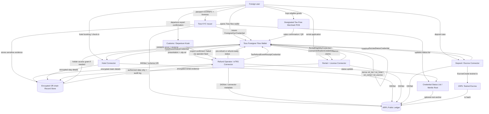

# 구현 흐름 및 서비스 그래프

이 문서는 개정된 제품 방향을 구현 단계로 나눕니다. 핵심은 **기존 actor를 대체하지 않고 연결한다**는 것입니다. 세금환급은 지정 면세판매장, 환급창구운영사업자/eTRS, 세관, 국세청 흐름을 그대로 두고, Toss wallet이 proof, 전표, 상태 receipt를 정리합니다.

## Phase 1 - Trust Anchor / Connector Setup

```yaml
tasks:
  - 각 issuer/connector용 XRPL account 생성
  - DIDSet으로 issuer 또는 connector DID 생성
  - DID document URI 게시
  - credential schema 게시
  - trust metadata 게시
  - status-list service 생성
  - mock refund-operator/eTRS connector 생성
```

운영 주체:

```yaml
actors:
  tossKycIssuer:
    role: passport/face/residence proof issuer
    credentialTypes:
      - ForeignerKycCredential

  taxRefundOperatorConnector:
    role: 지정 환급사업자/eTRS 연동 또는 mock
    credentialTypes:
      - TaxRefundReadinessCredential
      - TaxRefundEventReceiptCredential
    doesNot:
      - approve refunds independently
      - replace customs export confirmation
      - submit tax settlement as Toss

  hotelPlatformConnector:
    role: 호텔 예약/체크인/보증금 event 연동
    credentialTypes:
      - HotelGuestStatusCredential

  rentalPlatformConnector:
    role: 렌탈 신청/면허 확인 event 연동
    credentialTypes:
      - RentalEligibilityCredential
      - LicenseVerificationCredential

  escrowServiceConnector:
    role: 호텔/렌탈 보증금 상태 또는 XRPL Testnet escrow demo
    credentialTypes:
      - EscrowStatusCredential

  trustRegistry:
    role: event type별 authorized signer DID와 인가/제휴 상태 매핑
    anchors:
      - trustPolicyHash
    maySyncWith:
      - registered tax-free merchant list
      - refund operator partner list
      - hotel/rental partner registry
```

## Phase 2 - Wallet Setup

```yaml
tasks:
  - holder DID 또는 holder keypair 생성
  - encrypted wallet store 생성
  - private identity graph 생성
  - service별 relationship ID derivation 구현
  - VC import/export 지원
  - VP 생성 지원
  - holder consent UI 지원
  - refund slip / QR / booking / license evidence import 지원
```

지갑 저장 원칙:

```yaml
walletStorage:
  localDevice:
    encrypted: true
    stores:
      - holder keys
      - VCs
      - relationship IDs
      - private identity graph
      - reusable E0 passport/KYC anchor
      - tax refund slip references
      - hotel/rental/deposit receipt references

  cloudBackup:
    encrypted: true
    stores:
      - encrypted VCs
      - encrypted service receipts
      - encrypted identity graph
    shouldNotStore:
      - plaintext private keys
      - plaintext passport data
      - plaintext refund receipt detail
      - plaintext hotel or rental contract detail
```

## Phase 3 - Tax Refund Streamlining

현재 흐름은 [tax-refund-flow.mmd](../../current-context/tax-refund-flow.mmd)와 [tax-refund-sequence.mmd](../../current-context/tax-refund-sequence.mmd)를 기준으로 구현합니다.

E0는 재사용합니다. 지갑은 `ForeignerKycCredential`을 한 번 발급 또는 import하고, 여러 구매/환급 chain은 같은 비공개 anchor에서 branch됩니다. 구매마다 여권 proof event를 새로 만들지 않습니다.

### 3-1. Immediate refund

```text
1. 고객이 지정 면세판매장에서 여권 proof 제시
2. 가맹점 POS가 즉시환급 조건과 한도를 확인
3. POS/환급사업자가 세액 차감 결제를 처리
4. Toss wallet은 전자판매확인서 또는 transaction receipt를 수신
5. TaxRefundEventReceiptCredential(status=immediate_refund_completed)을 저장
```

Toss가 하지 않는 일:

```yaml
doesNot:
  - POS approval
  - tax amount calculation
  - refund operator settlement
  - NTS reporting
```

### 3-2. General refund

```text
1. 고객이 세금 포함 정상가로 결제
2. 가맹점이 물품판매확인서/환급전표/QR을 발급
3. Toss wallet이 전표를 import하고 purchase_record_registered event 생성
4. 시내 환급이면 환급사업자에게 wallet presentation 제출
5. 환급사업자는 pre-refund/provisional 상태를 반환
6. 출국 시 고객이 세관/kiosk에서 반출 확인
7. 환급사업자가 export_confirmed 또는 export_failed 상태를 수신
8. wallet이 payout_completed 또는 refund_cancelled receipt를 저장
```

상태 enum:

```yaml
taxRefundStatuses:
  - purchase_record_registered
  - immediate_refund_completed
  - downtown_prerefunded
  - card_authorization_verified
  - refund_operator_accepted
  - airport_refund_ready
  - export_confirmation_required
  - export_confirmed
  - export_failed
  - payout_pending
  - payout_completed
  - refund_cancelled
```

### 3-3. Tax refund proof chain

여기서 "chain"을 가장 잘 쓸 수 있습니다. 단, public chain에 `eventType`을 포함한 환급 내역 전체를 올리는 것이 아니라, 각 actor가 만든 비공개 상태 event를 off-chain hash-linked receipt로 만들고 XRPL에는 issuer/connector DID와 status/proof root만 anchor합니다.

```text
passport_verified / tax_refund_readiness
  -> item_purchased
  -> tax_free_status_verified
  -> kiosk_refund_requested
  -> card_authorization_verified
  -> refund_operator_accepted
  -> export_confirmation_required
  -> customs_export_confirmed
  -> card_settlement_completed
```

각 event receipt는 다음 필드를 가집니다.

```json
{
  "eventId": "evt_taxrefund_01J8TXA_004",
  "relationshipId": "rel_tax_2vBq9F7L8Qx3mZpT",
  "eventType": "refund_operator_accepted",
  "sourceActor": "refund_operator",
  "sourceActorDid": "did:xrpl:1:rREFUND_OPERATOR_CONNECTOR",
  "occurredAt": "2026-05-02T05:30:00Z",
  "previousEventHash": "sha256:prev-event",
  "eventPayloadHash": "sha256:canonical-private-payload",
  "offchainRecordRef": "offrec_tax_claim_01J8TXA",
  "statusListIndex": "39201",
  "proof": {
    "type": "DataIntegrityProof",
    "verificationMethod": "did:xrpl:1:rREFUND_OPERATOR_CONNECTOR#key-1",
    "proofPurpose": "assertionMethod",
    "proofValue": "z..."
  }
}
```

검증자는 다음만 확인합니다.

```text
1. 각 event signer DID가 신뢰 가능한 actor인지 확인
2. previousEventHash로 순서가 끊기지 않았는지 확인
3. eventPayloadHash가 오프체인 원본과 일치하는지 확인
4. status list / Merkle root가 XRPL에 anchor된 값과 일치하는지 확인
5. holder consent와 access grant가 있는 범위에서만 상세 evidence 조회
```

구현 가능성:

```yaml
mvp:
  onChain:
    - issuer/connector DID
    - schema hash
    - status-list Merkle root
    - optional final proof-chain root
    - never eventType, receipt detail, user DID, or per-event timestamp
  offChain:
    - passport evidence
    - item/receipt detail
    - kiosk number
    - card authorization token
    - refund operator payload
    - customs confirmation payload
    - settlement detail
  wallet:
    - ordered TaxRefundEventReceiptCredential list
    - proof-chain progress UI
    - shareable VP for selected events
```

법적 마찰은 "이 proof chain을 법적 환급 승인 원장으로 주장할 때" 생깁니다. 해커톤/PoC에서는 **기존 actor의 처리 결과를 변조 방지 receipt로 묶는 구조**로 표현하면 구현 가능성이 높습니다.

다이어그램: [privacy-preserving-proof-chain.mmd](../../privacy-preserving-proof-chain.mmd).

전표 import API sketch:

```http
POST /tax-refund/slips/import
```

```json
{
  "relationshipId": "rel_tax_2vBq9F7L8Qx3mZpT",
  "source": "merchant_qr",
  "merchantRef": "merchant_oliveyoung_myeongdong",
  "refundOperatorRef": "operator_mock_globaltaxfree",
  "slipPayloadToken": "upload_token_slip_abc",
  "holderConsent": true
}
```

event receipt API sketch:

```http
POST /service-events/tax-refund
```

```json
{
  "relationshipId": "rel_tax_2vBq9F7L8Qx3mZpT",
  "eventType": "tax_refund_state_update",
  "status": "downtown_prerefunded",
  "sourceActor": "refund_operator",
  "offchainRecordRef": "offrec_tax_claim_01J8TXA",
  "offchainRecordHash": "sha256:3bc4c1...",
  "issueReceiptCredential": true
}
```

## Phase 4 - Presentation / Verification

```text
1. Verifier 또는 connector가 proof request 전송
2. Wallet이 verifier DID와 requested scope 확인
3. Wallet이 allowlist template으로 자연어 동의 요약 생성
4. 사용자가 동의
5. Wallet이 VP 생성
6. Verifier가 issuer DID resolve
7. Verifier가 issuer signature 검증
8. Verifier가 holder signature 검증
9. Verifier가 expiration/status list 확인
10. Connector가 현행 시스템 action을 호출하거나 상태 event를 저장
```

세금환급 proof request:

```json
{
  "type": "PresentationRequest",
  "verifierDid": "did:xrpl:1:rREFUND_OPERATOR_CONNECTOR",
  "purpose": "tax_refund_processing",
  "requestedCredentialTypes": [
    "ForeignerKycCredential",
    "TaxRefundReadinessCredential"
  ],
  "requestedClaims": [
    "passportProofVerified",
    "refundSlipPresent",
    "holderConsent"
  ],
  "consentDescriptor": {
    "templateId": "tax_refund_kiosk_verify_v1",
    "locale": "ko-KR",
    "requesterDisplayName": "인천공항 환급 키오스크",
    "requestedSummaryFields": [
      "여권 확인 여부",
      "면세 구매 증명"
    ],
    "withheldSummaryFields": [
      "여권 원본 정보",
      "카드 인증 원문",
      "다른 서비스 이용 내역"
    ],
    "retention": "session_only"
  },
  "forbiddenClaims": [
    "passportNumber",
    "nationality",
    "arcNumber",
    "fullReceiptDetail"
  ],
  "challenge": "verifier_nonce_tax_abc123",
  "domain": "tax-refund.toss.example"
}
```

UI는 `templateId`와 structured fields로 `환급을 위해 여권 확인 여부와 면세 구매 증명을 확인할게요` 같은 문장을 로컬에서 만듭니다. request signature는 descriptor까지 포함하지만, verifier가 임의의 최종 문구를 주입할 수는 없습니다.

## Phase 5 - Hotel / Rental Modules

호텔:

```text
1. 사용자 wallet이 hotel relationship ID 생성
2. 호텔 connector가 예약번호 또는 booking token 확인
3. 사용자가 passport proof + booking proof를 선택 공개
4. 호텔 connector가 check_in_pending / checked_in / checked_out event 발급
5. wallet이 HotelGuestStatusCredential 또는 receipt 저장
```

렌탈:

```text
1. 사용자 wallet이 rental relationship ID 생성
2. 렌탈 connector가 KYC, 체류 유효성, 면허 확인 proof request 전송
3. wallet이 필요한 yes/no claim만 공개
4. connector가 rental_application_submitted / approved / rejected event 저장
5. LicenseVerificationCredential과 RentalEligibilityCredential을 wallet에 저장
```

## Phase 6 - Deposit / Escrow Linkage

호텔 또는 렌탈 보증금 흐름:

```text
1. 사용자가 hotel/rental eligibility proof 제출
2. Escrow connector가 deposit case 생성
3. deposit case가 relationshipId에 연결
4. MVP에서는 XRPL Testnet EscrowCreate로 조건부 lock demo
5. EscrowStatusCredential을 사용자에게 발급
6. 조건 충족 시 EscrowFinish 또는 off-chain release event 저장
7. EscrowStatusCredential을 released/cancelled 상태로 업데이트
```

상용 단계에서는 실제 보증금 수취/반환이 전자금융, 결제대행, 여신, 임대차 규제에 닿을 수 있으므로 인허가 partner rail을 전제합니다.

## Agent-Readable Checklist

```yaml
implementation:
  services:
    xrplAdapter:
      responsibilities:
        - submit DIDSet
        - fetch DID ledger entry
        - fetch native Credential only for coarse authorization
        - anchor status-list hashes
        - submit optional testnet escrow transactions

    walletService:
      responsibilities:
        - manage holder keys
        - store encrypted credentials and receipts
        - derive relationship IDs
        - maintain private identity graph
        - generate verifiable presentations
        - collect holder consent
        - import tax slips / booking refs / license evidence

    connectorGateway:
      responsibilities:
        - authenticate merchant/refund/hotel/rental connectors
        - map connector events into service event records
        - avoid claiming regulated operator authority

    taxRefundWorkflowService:
      responsibilities:
        - reuse E0 passport/KYC anchor across multiple refund cases
        - model immediate/general/downtown/airport branches
        - store refund slip envelopes off-chain
        - issue TaxRefundReadinessCredential
        - issue TaxRefundEventReceiptCredential
        - track provisional/final/failure status

    presentationExchangeService:
      responsibilities:
        - receive scoped presentation requests from operators/vendors
        - prevent unrelated chain disclosure
        - generate selective presentations from wallet-held VCs/events

    trustRegistryService:
      responsibilities:
        - maintain authorized signer DIDs per event type
        - publish trust-policy hash
        - check merchant/operator/vendor authorization before accepting signatures
        - reject valid signatures from unauthorized DIDs

    backupService:
      responsibilities:
        - encrypt private proof-chain database for backup
        - support device recovery without exposing plaintext to Toss
        - preserve E0 and branch event history across device changes

    verifierService:
      responsibilities:
        - create presentation requests
        - resolve issuer DID
        - verify VC proof
        - verify VP proof
        - check credential status
        - make service decision or connector call

    accessControlService:
      responsibilities:
        - validate holder access grants
        - issue short-lived access tokens
        - enforce scopes
        - log evidence access

    serviceEventService:
      responsibilities:
        - create service event records
        - issue event receipt credentials
        - link tax/hotel/rental/license/escrow events to relationship IDs

  doNotStoreOnChain:
    - passport number
    - ARC number
    - visa type
    - nationality unless strictly reviewed
    - tax refund receipt detail
    - refund amount
    - hotel stay details
    - rental contract details
    - license number
    - full VC payload

  safeOnChain:
    - issuer DID
    - issuer public key reference
    - schema hash
    - status-list hash
    - coarse credential type
    - escrow tx hash
    - payment settlement tx hash
```

## Onboarding / Service Graph



## 발표용 문구

권장:

> "XRPL은 issuer identity, credential schema integrity, revocation/status commitment의 공개 신뢰 앵커로 사용합니다. Toss wallet은 세금환급, 호텔, 렌탈, 보증금 event를 private relationship ID로 연결하고, 민감한 전표/여권/계약 정보는 오프체인에 암호화해 둡니다. 환급 승인과 반출 확인은 기존 환급사업자와 세관의 역할로 남깁니다."

피해야 할 문구:

> "Toss가 외국인 세금환급을 직접 승인하고 환급 내역을 블록체인에 저장합니다."
