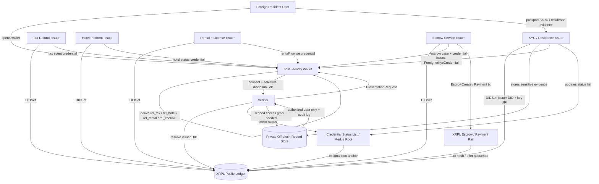

# 구현 흐름 및 온보딩 그래프

이 문서는 아키텍처를 실제 구현 단계와 서비스 책임으로 나눕니다.

## Phase 1 - Issuer Setup

```yaml
tasks:
  - issuer별 XRPL account 생성
  - DIDSet으로 issuer DID 생성
  - DID document 게시
  - credential schema 게시
  - trust metadata 게시
  - status-list service 생성
```

필수 Issuer:

```yaml
issuers:
  tossKycIssuer:
    credentialTypes:
      - ForeignerKycCredential

  taxRefundIssuer:
    credentialTypes:
      - TaxRefundEligibilityCredential
      - TaxRefundEventCredential

  hotelIssuer:
    credentialTypes:
      - HotelGuestStatusCredential

  rentalIssuer:
    credentialTypes:
      - RentalEligibilityCredential
      - LicenseVerificationCredential

  escrowIssuer:
    credentialTypes:
      - EscrowStatusCredential
```

## Phase 2 - Wallet Setup

```yaml
tasks:
  - holder DID 또는 holder keypair 생성
  - encrypted wallet store 생성
  - private identity graph 생성
  - relationship ID derivation 함수 구현
  - VC import/export 지원
  - VP 생성 지원
  - holder consent UI 지원
```

지갑 저장 원칙:

```yaml
walletStorage:
  localDevice:
    encrypted: true
    stores:
      - holder keys
      - VCs
      - relationship IDs
      - private identity graph

  cloudBackup:
    encrypted: true
    stores:
      - encrypted VCs
      - encrypted identity graph
    shouldNotStore:
      - plaintext private keys
      - plaintext passport data
      - plaintext ARC data
```

## Phase 3 - Credential Issuance

```text
1. 사용자가 KYC / eligibility check 완료
2. Issuer가 민감 문서를 오프체인에서 검증
3. Issuer가 off-chain evidence record 생성
4. Issuer가 사용자 지갑으로 VC 발급
5. Issuer가 credential status list 업데이트
6. 선택: status-list hash를 XRPL에 anchor
7. 선택: coarse XRPL Credential 생성
```

API sketch:

```http
POST /issuance/request
```

```json
{
  "holderDid": "did:xrpl:1:rHOLDER_PAIRWISE_TAX",
  "credentialType": "TaxRefundEligibilityCredential",
  "serviceDomain": "tax_refund",
  "relationshipId": "rel_tax_2vBq9F7L8Qx3mZpT",
  "documents": {
    "passportEvidenceToken": "upload_token_abc",
    "residenceEvidenceToken": "upload_token_def"
  }
}
```

## Phase 4 - Presentation / Verification

```text
1. Verifier가 proof request 전송
2. Wallet이 verifier DID와 requested scope 확인
3. 사용자가 동의
4. Wallet이 VP 생성
5. Verifier가 issuer DID resolve
6. Verifier가 issuer signature 검증
7. Verifier가 holder signature 검증
8. Verifier가 expiration/status list 확인
9. Verifier가 service action 승인 또는 거절
```

검증 결과 예시:

```json
{
  "verified": true,
  "holderAuthenticated": true,
  "issuerTrusted": true,
  "credentialStatus": "valid",
  "disclosedClaims": {
    "rentalEligible": true,
    "residenceStatusChecked": true,
    "licenseVerified": true
  },
  "relationshipId": "rel_rental_X8mw21",
  "serviceDecision": "allow_rental_application"
}
```

## Phase 5 - Service Event Linking

각 서비스는 signed event receipt credential을 생성합니다.

```text
Tax refund submitted
  -> TaxRefundEventCredential

Hotel checked in
  -> HotelGuestStatusCredential update or event receipt

Rental approved
  -> RentalEligibilityCredential update or event receipt

License checked
  -> LicenseVerificationCredential

Escrow funded
  -> EscrowStatusCredential
```

## Phase 6 - Escrow Linkage

렌탈 보증금 또는 호텔 보증금 흐름:

```text
1. 사용자가 rental/hotel eligibility 증명
2. Escrow service가 escrow case 생성
3. Escrow case가 relationshipId에 연결
4. XRPL EscrowCreate로 자금 lock
5. EscrowStatusCredential을 사용자에게 발급
6. 조건 충족 시 EscrowFinish로 release
7. EscrowStatusCredential을 released 상태로 업데이트
```

## Agent-Readable Checklist

```yaml
implementation:
  services:
    xrplAdapter:
      responsibilities:
        - submit DIDSet
        - fetch DID ledger entry
        - fetch Credential ledger entry if used
        - submit optional escrow transactions
        - anchor status-list hashes

    issuerService:
      responsibilities:
        - verify documents off-chain
        - issue VCs
        - manage credential schemas
        - manage status lists
        - revoke credentials
        - store evidence records

    walletService:
      responsibilities:
        - manage holder keys
        - store encrypted credentials
        - derive relationship IDs
        - maintain private identity graph
        - generate verifiable presentations
        - collect holder consent

    verifierService:
      responsibilities:
        - create presentation requests
        - resolve issuer DID
        - verify VC proof
        - verify VP proof
        - check credential status
        - make service decision

    accessControlService:
      responsibilities:
        - validate holder access grants
        - issue short-lived access tokens
        - enforce scopes
        - log evidence access

    serviceEventService:
      responsibilities:
        - create service event records
        - issue event receipt credentials
        - link tax/hotel/rental/license/escrow events to relationship IDs
```

## Onboarding Graph



## 발표용 문구

권장:

> "XRPL DID는 issuer identity, credential schema integrity, revocation/status commitment의 공개 신뢰 앵커로 사용합니다. 사용자의 Toss Identity Wallet은 VC를 비공개로 저장하고 tax refund, hotel, rental, license, escrow 이벤트를 pairwise relationship ID로 연결합니다. 민감 문서와 거래 기록은 오프체인에 두고 사용자 동의 기반 접근 제어를 적용합니다."

피해야 할 문구:

> "외국인의 세금, 호텔, 렌탈, 면허 상태를 public chain에 저장합니다."
