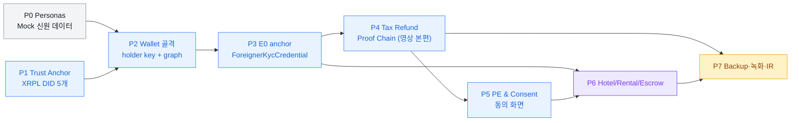

# Phase 별 실행 계획 — Toss Foreigner Flow Layer

이 폴더는 [revised-plan-summary](../docs/revised-plan-summary.md)와
[mvp-video-demo-plan](../docs/mvp-video-demo-plan.md)을 **8 phase 실행 계획**으로
풀어낸 것입니다. 각 phase는 학습 목표, 다이어그램, 코드 예시, 검증 체크리스트,
함정을 모두 담고 있어 학부 4학년 수준에서 따라 만들 수 있도록 작성됐습니다.

## 폴더 구조

```text
plan/
├── README.md             ← 이 파일 (인덱스 + 의존성 그래프)
├── architecture.md       ← 4-layer 분리 + on-chain/off-chain 경계
├── glossary.md           ← 65개 핵심 용어 사전
├── diagrams.md           ← 5개 mermaid 다이어그램 갤러리
├── phase-0.md            ← Pre-flight: 페르소나 + Mock 신원 데이터
├── phase-1.md            ← Required: Trust Anchor & Connector 부트스트랩
├── phase-2.md            ← Required: Toss 인앱 지갑 골격
├── phase-3.md            ← Required: E0 + ForeignerKycCredential
├── phase-4.md            ← Required (영상 본편): 세금환급 Proof Chain
├── phase-5.md            ← Required: Presentation Exchange & 동의 화면
├── phase-6.md            ← Should + Nice: 호텔/렌탈/보증금 분기
├── phase-7.md            ← Polish: 백업·복구·영상·IR
└── personas/             ← Phase 0의 실제 산출물 (Mock 신원 dataset)
    ├── README.md
    ├── schema/           ← JSON Schema (MOCK- prefix 강제)
    ├── jane_doe/         ← USA · B-2 · 시내 선환급
    ├── wang_xiaolei/     ← CHN · C-3-1 · 즉시환급
    ├── sato_haruki/      ← JPN · B-1 · 공항 환급 + 렌탈
    ├── priya_iyer/       ← IND · D-2 · 환급 외 호텔/렌탈
    └── mia_kovac/        ← HRV · D-10 · 입국 직후 시내 환급
```

## docs/ 와의 차이

| 폴더 | 역할 |
|---|---|
| [`docs/`](../docs/README.md) | 원본 설계 문서 (architecture, security, 한/영 plan) |
| `plan/` | 그 위에 얹은 **실행 계획** + Phase 0 산출물 |

docs는 "왜 이런 구조인가"를 설명하고, plan은 "어떤 순서로 무엇을 만들 것인가"를
phase 단위로 풉니다. 두 폴더는 함께 읽을 때 가장 잘 작동합니다.

## 의존성 그래프



## 8 phase 한눈에

| # | 분류 | 제목 | 시간 | prereq |
|---|---|---|---:|---|
| [0](phase-0.md) | Pre-flight | 페르소나 & Mock 신원 데이터 | 30분 | — |
| [1](phase-1.md) | Required | Trust Anchor & Connector 부트스트랩 | 60분 | P0 |
| [2](phase-2.md) | Required | Toss 인앱 지갑 골격 (XRPL holder) | 90분 | P0, P1 |
| [3](phase-3.md) | Required | E0 여권 anchor & ForeignerKycCredential | 60분 | P0, P1, P2 |
| [4](phase-4.md) | Required · **영상 본편** | 세금환급 Proof Chain | 180분 | P0, P1, P2, P3 |
| [5](phase-5.md) | Required | Presentation Exchange & 동의 화면 | 60분 | P3, P4 |
| [6](phase-6.md) | Should + Nice | 호텔 / 렌탈 / 보증금 분기 | 120분 | P3, P5 |
| [7](phase-7.md) | Polish | 백업·복구 데모 + 영상·IR 마무리 | 90분 | P4, P5, P6 |

총 예상 시간 ≈ **11.5시간**.

## 추천 학습 순서

1. [`architecture.md`](architecture.md) — 4-layer 분리 먼저 (15분)
2. [`glossary.md`](glossary.md) — 모르는 용어가 5개 이하가 될 때까지 훑기
3. [`phase-0.md`](phase-0.md) → [`phase-1.md`](phase-1.md) → … → [`phase-7.md`](phase-7.md) 순서대로
4. [`personas/`](personas/README.md) — Phase 0 산출물을 직접 보면서 phase 진행

## 면책

본 문서는 KFIP 2026 Toss Special Award 출품용 PoC의 학습/구현 계획이며 법률
자문이 아닙니다. 모든 mock 데이터는 `MOCK-` prefix로 표시되어 있고, 실제 사람·
여권·면허·금융계좌가 아닙니다. 상용화 전에는 환급사업자, 세무/관세 전문가,
금융규제 전문가와 별도 검토가 필요합니다.
