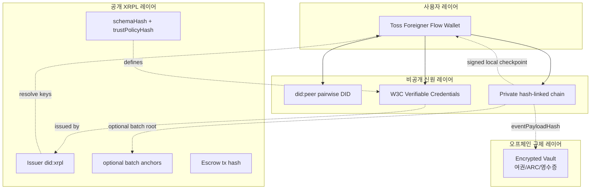

# 아키텍처 — 데이터가 어디 사는지 4-layer로 분리한다

[XRPL](glossary.md#xrpl)은 사용자 행동 로그가 아니라 발급자 공개키와
[commitment](glossary.md#commitment)의 공개 신뢰 앵커입니다. 사용자 데이터는
[did:peer](glossary.md#did-peer) + [VC](glossary.md#vc) + 암호화 vault에 분산
저장됩니다.

## 4-layer 분리



### 1. Toss Foreigner Flow Wallet (User-facing)

| | |
|---|---|
| **위치** | `frontend/src/wallet/` (frontend-only PoC, 별도 backend 없음) |
| **포함되는 것** | holder keypair (`did:key`) · 암호화 store + private identity graph · 서비스별 `relationshipId` · Toss-style mini-app UI |
| **내부 구조** | 4-layer (crypto / storage / identity / state) — 자세히는 [Phase 2 § Wallet 4-layer 구조](phase-2.md#wallet-4-layer-구조) |
| **어디서 등장** | [Phase 2](phase-2.md), [Phase 3](phase-3.md), [Phase 5](phase-5.md) |
| **규칙** | 사용자 통제. 모든 PII는 여기서 사용자 키로 암호화돼 있다가 vault로 백업된다. 페이지는 Layer 4 (Zustand `useWallet`)만 import — Layer 1~3 직접 호출 금지. |

### 2. Private Identity Layer (Off-chain, holder-controlled)

| | |
|---|---|
| **포함되는 것** | [`did:peer`](glossary.md#did-peer) pairwise DID · W3C [Verifiable Credentials](glossary.md#vc) · private hash-linked event chain · signed `proofChainRoot` / `statusRoot` checkpoint · consent / access-grant 기록 |
| **어디서 등장** | [Phase 4 proof chain E0~E7](phase-4.md), [Phase 5 VP](phase-5.md), [Phase 6 hotel/rental 분기](phase-6.md) |
| **규칙** | 서비스 도메인별로 격리. 같은 사용자의 tax/hotel/rental chain이 자동으로 연결되지 않는다. |

### 3. Public XRPL Trust Layer

| | |
|---|---|
| **포함되는 것** | Issuer/Connector [`did:xrpl`](glossary.md#did-xrpl) · `verificationMethod` 공개키 · schema hash · trust policy hash · optional batched [`proofChainRoot`](glossary.md#proof-chain-root) / `statusRoot` commitment · optional [escrow tx hash](glossary.md#escrow-create) |
| **어디서 등장** | [Phase 1 DIDSet 5개](phase-1.md), [Phase 4 signed local root checkpoint](phase-4.md), [Phase 6 EscrowCreate Testnet tx](phase-6.md) |
| **규칙** | opaque commitment만. event type, user DID, 영수증 detail, kiosk 번호, 카드 token, 어떤 timestamp도 절대 올리지 않는다. |

### 4. Regulated Encrypted Off-chain Vault

| | |
|---|---|
| **포함되는 것** | 여권 · [ARC](glossary.md#arc) · 비자 원본 · 면세 영수증 · 환급 case file · 호텔 예약 · 렌탈 계약 · 면허 검증 로그 · 에스크로 case file · audit log |
| **어디서 등장** | [Phase 3 KYC vault 진입](phase-3.md), [Phase 7 crypto-shredding 시연](phase-7.md) |
| **규칙** | 특금법 §5-2 ③ 5년 보존 의무. [envelope encryption](glossary.md#envelope-encryption) + [HSM](glossary.md#hsm) + dual control. 사용자 grant 없이 verifier가 못 본다. |

## Frontend 안에서의 위치 매핑

이 PoC는 frontend-only입니다. 위 4-layer가 `frontend/src/` 안에서 어떻게
배치되는지:

```text
frontend/src/
├── pages/           # 기존 20개 mockup — Layer 1 (Wallet UI 화면)
├── wallet/          # Layer 1 (사용자 wallet) + Layer 2 (private identity)
│   ├── crypto/      # 키·서명·해시 (pure TS)
│   ├── storage/     # IndexedDB + AES-GCM (Layer 1의 암호화 store)
│   ├── identity/    # PrivateIdentityGraph + proof-chain (Layer 2)
│   ├── personas/    # Phase 0 JSON 어댑터
│   └── state/       # Zustand store (페이지 ↔ wallet 연결)
└── mocks/           # Layer 3 (XRPL trust)의 mock + 검증자
    ├── connectors/  # 5개 actor mock (Phase 1 DID와 짝)
    └── kiosk/       # 키오스크 검증자 mock
```

> Layer 3 (Public XRPL)는 실제 Testnet 또는 in-app mock 둘 다 가능. 영상
> reproducibility를 위해 default는 `frontend/src/mocks/`의 in-app mock.
>
> Layer 4 (Regulated Vault)는 PoC scope 외 — Phase 7에서 "Toss는 ciphertext만
> 보관 가능"을 IndexedDB export로 시연.

## On-chain / Off-chain 경계

가장 자주 헷갈리는 지점. 아래 표는 [on-chain](glossary.md#on-chain)에 올려도
되는 것과 [off-chain](glossary.md#off-chain)에 둬야 하는 것을 정확히 분리합니다.

### XRPL에 올려도 OK

- Issuer / Connector DID
- `verificationMethod` 공개키 (DID document)
- schema hash 또는 URI
- batch-level status-list hash 또는 Merkle root (옵션)
- coarse credential type (`ComplianceTierA` 같은 것)
- batch-level `proofChainRoot` commitment (옵션)
- `EscrowCreate` / `EscrowFinish` tx hash
- payment settlement tx hash

### 절대 XRPL에 올리지 말 것

- 여권번호
- ARC 번호
- 비자 유형
- 국적 (특별 검토 없으면)
- 세금 환급 영수증 detail
- 환급 금액
- 호텔/렌탈 계약 detail
- 면허번호
- 전체 VC payload
- 사용자 DID
- event type / case ID
- per-event timestamp

> [DID](glossary.md#did) 문서나 ledger entry는 **누구나 조회 가능**합니다.
> 여권번호·체류자격 같은 PII를 한 번이라도 올리면 영구 공개. 그래서 사용자
> 식별자는 [`did:peer`](glossary.md#did-peer)로 비공개 처리하고, XRPL에는 issuer
> 공개키와 opaque hash만 둡니다.

## 식별자 구분표

| 식별자 | 공개? | 목적 |
|---|---|---|
| [`did:xrpl`](glossary.md#did-xrpl) | **Yes** | Issuer / Connector 공개키 발견용 |
| [`did:key`](glossary.md#did-key) | No | 지갑의 로컬 holder root, 단말 안에서만 |
| [`did:peer`](glossary.md#did-peer) + [`relationshipId`](glossary.md#relationship-id) | No | 한 verifier 와의 비공개 관계 |
| [`proofChainRoot`](glossary.md#proof-chain-root) | No by default · optional batch anchor | wallet에 저장되는 signed checkpoint. 필요한 경우 여러 사용자/케이스 root를 묶은 batch commitment만 XRPL에 anchor |
| `statusRoot` | No by default · optional batch anchor | wallet에 저장되는 signed status checkpoint. 필요한 경우 issuer가 여러 status update를 묶은 batch Merkle root만 XRPL에 anchor |

## Root checkpoint 규칙

`proofChainRoot`와 `statusRoot`는 production에서 사용자별 XRPL write를 만들지 않습니다.
기본 위치는 wallet의 encrypted store이며, issuer/operator/POS/Toss connector가 서명한
checkpoint로 검증합니다.

```json
{
  "type": "WalletRootCheckpoint",
  "relationshipId": "rel_tax_2vBq9F7L8Qx3mZpT",
  "serviceDomain": "tax_refund",
  "treeRoot": "sha256:domain-tree-root",
  "proofChainRoot": "sha256:case-tip",
  "statusRoot": "sha256:status-list-root",
  "checkpointSequence": 17,
  "createdAt": "2026-05-02T05:40:00Z",
  "validUntil": "2026-05-02T06:10:00Z",
  "issuerDid": "did:xrpl:1:rREFUND_OPERATOR_CONNECTOR",
  "proof": {
    "verificationMethod": "did:xrpl:1:rREFUND_OPERATOR_CONNECTOR#key-1",
    "proofValue": "z..."
  }
}
```

검증자는 `proof` 서명, `createdAt` / `validUntil`, 그리고 `checkpointSequence`가
이전에 본 값보다 뒤인지 확인합니다. POS나 Toss 서버가 "이 relationship을 마지막으로
본 checkpoint"를 저장할 때는 전역 wallet ID가 아니라 서비스별 `relationshipId` 또는
pairwise DID 기준으로 저장해야 합니다. 그래야 rollback은 막으면서 tax/hotel/rental
활동이 공개적으로 연결되지 않습니다.

## 원본 문서 참조

- [`docs/ko/architecture/overview.ko.md`](../docs/ko/architecture/overview.ko.md) — 4-layer 원본
- [`docs/ko/architecture/identifiers.ko.md`](../docs/ko/architecture/identifiers.ko.md) — 식별자 모델
- [`docs/ko/architecture/credentials.ko.md`](../docs/ko/architecture/credentials.ko.md) — DID·VC·status list
- [`docs/ko/architecture/records-access.ko.md`](../docs/ko/architecture/records-access.ko.md) — 접근 제어
- [`docs/ko/security/encryption-architecture.ko.md`](../docs/ko/security/encryption-architecture.ko.md) — 암호화 7층
- [`docs/ko/security/key-and-state-recovery.ko.md`](../docs/ko/security/key-and-state-recovery.ko.md) — 키·상태 복구
