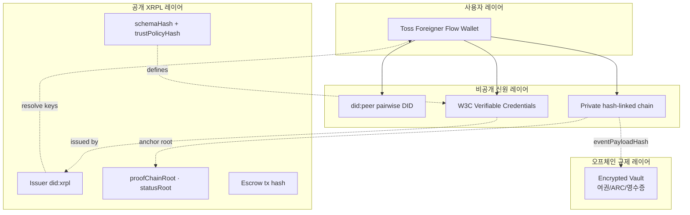
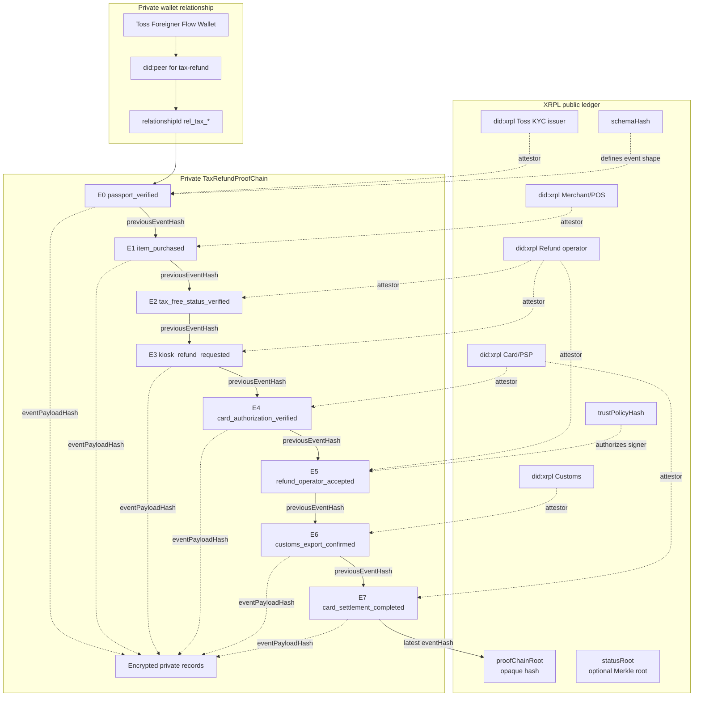
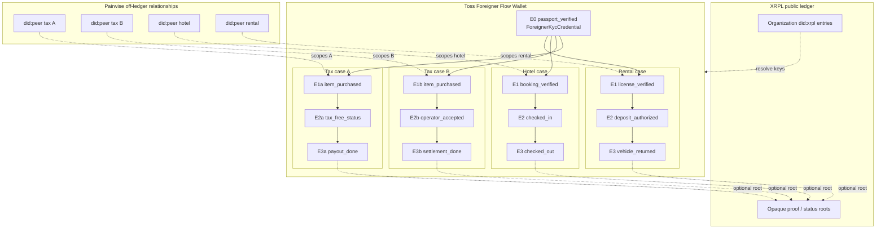
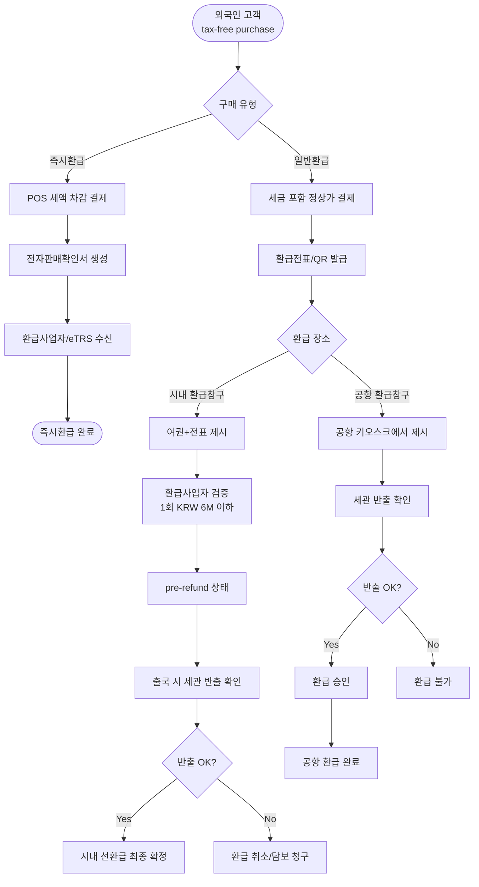
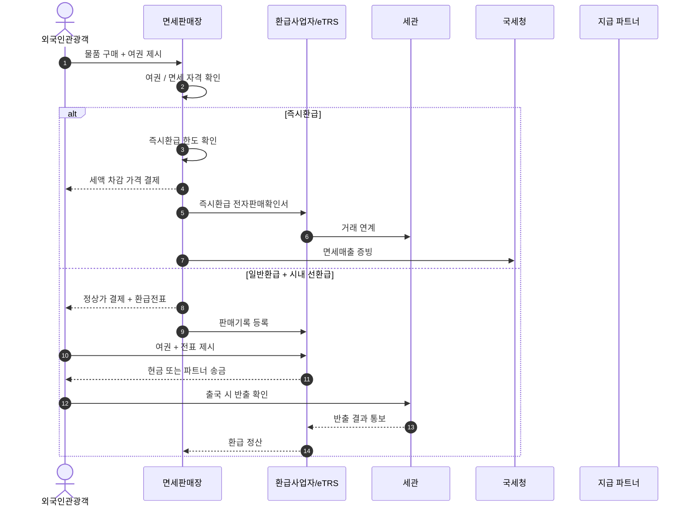

# 다이어그램 갤러리

이 프로젝트의 핵심 mermaid 다이어그램 5개를 한 곳에 모았습니다. 그림 하나씩
직접 그려보면서 학습하기 좋습니다.

## 1. 아키텍처 개요 — 4-layer 분리

사용자 / 비공개 / 공개 XRPL / 오프체인 규제 4개 레이어. 각 데이터가 어디
사는지 한눈에. 자세한 설명은 [`architecture.md`](architecture.md).

> **source**: `docs/ko/architecture/overview.ko.md` 기반 재구성

## 2. Privacy-Preserving Proof Chain

XRPL에는 opaque hash만, 비공개 chain에는 실제 event들. `attestorDid`가 누가
무엇을 서명했는지 검증. 자세한 설명은 [`phase-4.md`](phase-4.md).

> **source**: [`docs/privacy-preserving-proof-chain.mmd`](../docs/privacy-preserving-proof-chain.mmd)

## 3. Multi-service E0 DAG

E0 `passport_verified`가 한 번 만들어지고 여러 서비스 case가 분기. pairwise
relationship으로 격리. 자세한 설명은 [`phase-3.md`](phase-3.md),
[`phase-6.md`](phase-6.md).

> **source**: [`docs/multi-service-e0-dag.mmd`](../docs/multi-service-e0-dag.mmd)

## 4. 현행 세금환급 flow

제품이 streamline해야 할 현실의 환급 분기 — 즉시환급 / 시내 선환급 / 공항
환급. 한국 외국인 부가세 환급의 실제 절차.

> **source**: [`docs/current-context/tax-refund-flow.mmd`](../docs/current-context/tax-refund-flow.mmd) 요약

## 5. 현행 세금환급 sequence

6명의 actor — 고객 / 매장 / 환급사업자 / 세관 / 국세청 / 지급파트너 — 사이의
메시지 흐름.

> **source**: [`docs/current-context/tax-refund-sequence.mmd`](../docs/current-context/tax-refund-sequence.mmd) 요약
