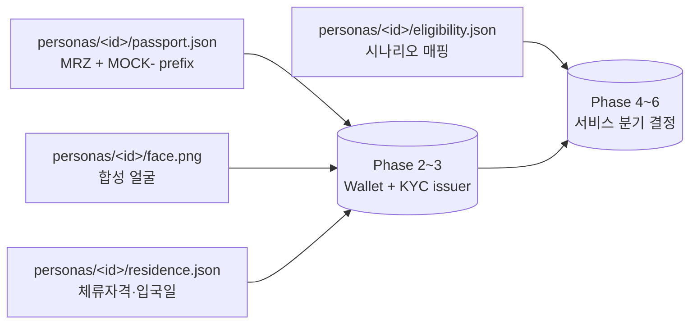

# Phase 0 — 페르소나 & Mock 신원 데이터

> **분류**: Pre-flight · **시간**: 30분 · **사전 phase**: 없음
> **다음 phase**: [Phase 1 — Trust Anchor 부트스트랩](phase-1.md)

## 한 줄 요약

코드 한 줄 쓰기 전에 5명의 외국인 페르소나와 그들의 여권/얼굴/체류자격
mockup JSON을 결정론적으로 만든다.

## 이 phase의 목표

이후 모든 phase가 같은 JSON dataset을 공유하도록 single source of truth를
만든다. mockup임이 한눈에 보이도록 `MOCK-` prefix를 강제한다.

## 핵심 용어

[KYC](glossary.md#kyc) · [CDD](glossary.md#cdd) · [ARC](glossary.md#arc) ·
[eTRS](glossary.md#etrs)

## 다이어그램



> *Phase 0의 4개 JSON 파일이 이후 모든 phase의 입력으로 흐른다.*

## 왜 이게 첫 phase인가

서비스의 입력은 결국 "한 사람의 여권 + 얼굴 + 체류자격" 입니다. 이게 정해지지
않으면 지갑 화면도, VC 발급도, 환급 분기도 다 가짜가 됩니다.

코드 작성 전에 dataset을 고정하면 (1) 데모가 일관되고, (2) 모든 phase가 같은
사람을 다루므로 cross-phase 검증이 쉬워지고, (3) 평가자가 "이 mock이 실제
데이터로 바뀌면 어떻게 되나"를 머리속에 그릴 수 있습니다.

## 페르소나가 풀어야 할 시나리오

각 페르소나는 최소 한 가지 분기 — 즉시환급 / 시내 선환급 / 공항 환급 — 를
자연스럽게 시연할 수 있어야 합니다.

예: 일본인 단기 관광객 (시내 선환급), 중국인 명품 쇼핑객 (즉시환급), 미국인
D-2 유학생 (입국 직후 장기체류 시나리오).

> 관련 용어: [eTRS](glossary.md#etrs) · [환급창구운영사업자](glossary.md#refund-operator)

## 필수 필드 체크리스트

- `passport.json`: MRZ format, 발급국, 만료일, `MOCK-` prefix가 들어간 여권번호
- `face.png`: 합성 얼굴 또는 placeholder 이미지 (저작권 안전한 것)
- `residence.json`: 체류자격 (D-2, C-3 등), 입국일, 체류 기한
- `eligibility.json`: 어떤 환급/호텔/렌탈 시나리오에 적합한가

## 코드로 보기

### `personas/jane_doe/passport.json`

```json
{
  "type": "MockPassport",
  "issuingCountry": "USA",
  "passportNumber": "MOCK-US-A12345678",
  "surname": "DOE",
  "givenNames": "JANE MIRA",
  "nationality": "USA",
  "dateOfBirth": "1999-03-15",
  "sex": "F",
  "dateOfExpiry": "2032-03-14",
  "mrz": [
    "P<USADOE<<JANE<MIRA<<<<<<<<<<<<<<<<<<<<<<<<",
    "MOCKUSA12345678USA9903154F3203148<<<<<<<<<<<<<<04"
  ]
}
```

### `personas/jane_doe/eligibility.json`

```json
{
  "scenarios": ["downtown_pre_refund", "hotel_check_in"],
  "preferredPayoutPartner": "card_visa_mock",
  "shoppingBudgetKRW": 750000
}
```

> 실제 5명분 산출물은 [`personas/`](personas/README.md) 폴더에 들어 있습니다.

## 검증 방법

- [ ] 모든 페르소나 폴더가 동일한 4개 파일 set을 가진다
- [ ] 여권번호 / 면허번호 등 모든 식별자가 `MOCK-` prefix를 가진다
- [ ] 각 페르소나가 demo storyboard의 분기 중 최소 1개를 매핑한다
- [ ] JSON schema validator로 각 파일이 valid함을 자동 검증한다

## 자주 빠지는 함정

- 실제 인물 사진 사용 → 초상권 위반. AI 합성 또는 무료 placeholder 사용.
- 실제 발급기관 prefix 사용 → 사기·문서위조 위험. 반드시 `MOCK-`.
- 한 페르소나가 너무 많은 시나리오를 cover하면 분기 demo가 흐려짐 → 1~2개로 한정.

## 원본 문서 참조

- [`docs/ko/plan.ko.md` §11 열린 결정사항](../docs/ko/plan.ko.md)
