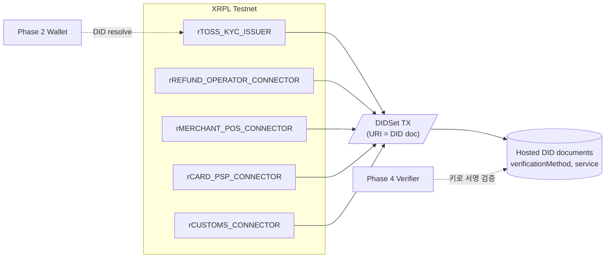

# Phase 1 — Trust Anchor & Connector 부트스트랩

> **분류**: Required MVP · **시간**: 60분 · **사전 phase**: [Phase 0](phase-0.md)
> **다음 phase**: [Phase 2 — Toss 인앱 지갑 골격](phase-2.md)

## 한 줄 요약

XRPL Testnet에 issuer/connector용 계정을 만들고 `DIDSet`으로 공개 DID를
등록한다. 사용자 지갑보다 먼저 깔아야 하는 공개 PKI.

## 이 phase의 목표

지갑이 나중에 받을 VC의 issuer 공개키를 체인에서 resolve할 수 있도록 5개
connector DID를 발급해 둔다.

## 핵심 용어

[XRPL](glossary.md#xrpl) · [DID](glossary.md#did) · [did:xrpl](glossary.md#did-xrpl) ·
[DIDSet](glossary.md#didset) · [Trust Anchor](glossary.md#trust-anchor)

## 다이어그램



> *5개 connector 계정 → DIDSet → 호스팅된 DID document. 지갑/검증자가 DID로 키를 resolve.*

## 왜 PKI를 먼저 깔아야 하나

VC는 issuer의 서명으로 검증됩니다. 검증하려면 issuer의 공개키가 필요합니다.
공개키는 어디서 가져올까요? 바로 XRPL의 DID document.

그래서 "지갑이 발급받을 VC가 나중에 verify되려면, 발급자가 먼저 자기 공개키를
XRPL에 올려놓아야" 합니다. 이게 Phase 1의 본질입니다.

> 관련 용어: [VC](glossary.md#vc) · [did:xrpl](glossary.md#did-xrpl) · [DIDSet](glossary.md#didset)

## 등록 대상 DID 5개

- `did:xrpl:1:rTOSS_KYC_ISSUER` — 여권/Face/체류 proof를 발급하는 토스 KYC issuer
- `did:xrpl:1:rREFUND_OPERATOR_CONNECTOR` — 환급사업자/eTRS mock
- `did:xrpl:1:rMERCHANT_POS_CONNECTOR` — 가맹점 POS mock
- `did:xrpl:1:rCARD_PSP_CONNECTOR` — 카드/PSP mock (authorization·settlement 서명)
- `did:xrpl:1:rCUSTOMS_CONNECTOR` — 세관/kiosk mock

> 관련 용어: [eTRS](glossary.md#etrs) · [환급창구운영사업자](glossary.md#refund-operator) · [POS](glossary.md#pos) · [PSP](glossary.md#psp)

## Mock connector는 어디에 사는가 (Phase 2와의 연결)

위 5개 DID는 **공개 trust anchor**입니다 — XRPL ledger에 등록된 공개키. 그러나
실제 서명을 만드는 mock actor (서명자)는 [Phase 2](phase-2.md)에서
`frontend/src/mocks/connectors/` 안에 **in-app 모듈**로 구현됩니다.

```text
frontend/src/mocks/connectors/
├── kyc-issuer.ts        ↔ did:xrpl:1:rTOSS_KYC_ISSUER
├── merchant-pos.ts      ↔ did:xrpl:1:rMERCHANT_POS_CONNECTOR
├── refund-operator.ts   ↔ did:xrpl:1:rREFUND_OPERATOR_CONNECTOR
├── card-psp.ts          ↔ did:xrpl:1:rCARD_PSP_CONNECTOR
├── customs.ts           ↔ did:xrpl:1:rCUSTOMS_CONNECTOR
├── trust-policy.ts      # actor × eventType 권한 매트릭스
└── keys/                # 각 connector의 mock keypair (build-time 생성)
```

별도 server 없음. 영상 reproducibility (`npm run dev` 한 번) 우선. 현실에서는
별도 server로 분리되지만, demo는 같은 frontend process 안에서 함수 호출로 충분.

## DIDSet 트랜잭션이란

XRPL의 DIDSet 트랜잭션은 한 계정에 DID entry를 만들거나 갱신합니다. URI /
Data / DIDDocument 중 최소 하나가 필요.

권장: URI에는 외부 호스팅된 DID document JSON의 위치만 두고, 개인정보는
절대 Data 필드에 넣지 않기.

> 관련 용어: [DIDSet](glossary.md#didset)

## 코드로 보기

### DIDSet 트랜잭션 페이로드

```json
{
  "TransactionType": "DIDSet",
  "Account": "rTOSS_KYC_ISSUER",
  "Fee": "10",
  "Sequence": 391,
  "URI": "68747470733a2f2f6973737565722e6578616d706c652e636f6d2f6469642f746f73732e6a736f6e",
  "Data": "",
  "SigningPubKey": "0330E7FC9D56BB25D6893BA3F317AE5BCF33B3291BD63DB32654A313222F7FD020"
}
```

> URI는 hex-encoded UTF-8. 디코드하면 DID document JSON URL.

### 호스팅되는 DID document

```json
{
  "@context": ["https://www.w3.org/ns/did/v1"],
  "id": "did:xrpl:1:rTOSS_KYC_ISSUER",
  "verificationMethod": [
    {
      "id": "did:xrpl:1:rTOSS_KYC_ISSUER#key-1",
      "type": "JsonWebKey2020",
      "controller": "did:xrpl:1:rTOSS_KYC_ISSUER",
      "publicKeyJwk": {
        "kty": "EC", "crv": "P-256",
        "x": "BASE64URL_X", "y": "BASE64URL_Y"
      }
    }
  ],
  "assertionMethod": ["did:xrpl:1:rTOSS_KYC_ISSUER#key-1"],
  "authentication": ["did:xrpl:1:rTOSS_KYC_ISSUER#key-1"]
}
```

## 검증 방법

- [ ] Testnet faucet으로 5개 계정 모두 funding 완료
- [ ] `xrpl` 라이브러리로 ledger entry 조회 → DIDSet entry 존재
- [ ] URI 디코드 → DID document fetch → 200 응답
- [ ] 각 DID에서 verificationMethod 공개키 추출 가능

## 자주 빠지는 함정

- `Data` 필드에 개인정보 넣기 → 영구 공개됨. 절대 금지.
- mainnet에 잘못 등록 → 비용 발생 + 영구 기록. 반드시 Testnet 명시.
- DID document URL에 https 미적용 → MITM 가능. HTTPS만.

## 원본 문서 참조

- [XRPL DIDSet docs](https://xrpl.org/docs/references/protocol/transactions/types/didset)
