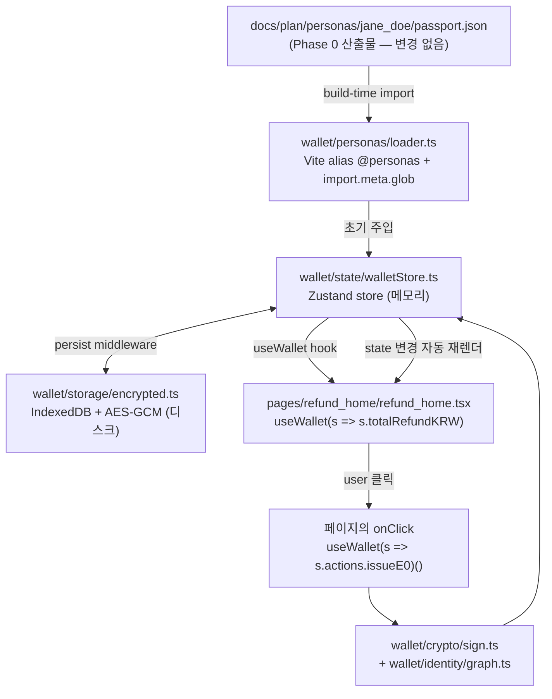

# Phase 2 — Toss 인앱 지갑 골격 (XRPL holder)

> **분류**: Required MVP · **시간**: 90분 · **사전 phase**: [P0](phase-0.md), [P1](phase-1.md)
> **다음 phase**: [Phase 3 — E0 anchor](phase-3.md)

## 한 줄 요약

`frontend/src/wallet/` 안에 4-layer wallet 골격(crypto / storage / identity / state)을
만들고, 기존 20개 page mockup에 retrofit해서 "여권 확인을 마쳤어요" 상태가 진짜
wallet state로 떠오르게 한다.

## 이 phase의 목표

페르소나 1명을 골라 진입하면 "여권 확인을 마쳤어요" 상태가 보이고, store
dump가 평문 PII를 가지지 않는다. 동시에 Phase 3~6에서 재사용할 4-layer 골격을
완성해 둔다.

## 핵심 용어

[React](glossary.md#react) · [Vite](glossary.md#vite) · [IndexedDB](glossary.md#indexeddb) ·
[AES-256-GCM](glossary.md#aes-gcm) · [did:key](glossary.md#did-key) ·
[Pairwise ID](glossary.md#pairwise-id) · [relationshipId](glossary.md#relationship-id) ·
[HKDF](glossary.md#hkdf) · [HMAC](glossary.md#hmac)

## Wallet 위치 — `frontend/src/wallet/`

이 프로젝트는 frontend-only PoC라서 **모든 wallet 코드가 `frontend/src/`
안**에 있습니다. 별도 백엔드/server 없음. 5개 mock connector도 같은 frontend
안의 in-app 모듈입니다 (별도 process 아님 — 영상 reproducibility 우선).

```text
frontend/src/
├── App.tsx                      # router 그대로 유지
├── main.tsx                     # wallet 초기화 한 줄 추가
├── pages/                       # 기존 20개 페이지 — 수정 대상 (retrofit)
├── wallet/                      # ← 신규 (이 phase의 핵심 산출물)
│   ├── index.ts                 # barrel export
│   ├── crypto/                  # Layer 1
│   ├── storage/                 # Layer 2
│   ├── identity/                # Layer 3
│   ├── personas/                # Phase 0 JSON 로더
│   └── state/                   # Layer 4 (Zustand)
└── mocks/                       # ← 신규 (mock connector + kiosk in-app)
    ├── connectors/              # 5개 actor mock (Phase 1 DID와 짝)
    └── kiosk/                   # 키오스크 검증자 mock
```

> 자세한 폴더 구조는 [§ Wallet 4-layer 구조](#wallet-4-layer-구조) 참고.

## Wallet 4-layer 구조

각 layer는 명확한 책임 경계를 가지며, 상위 layer만 React에 의존합니다. 이
분리 덕에 Layer 1~3은 단위 테스트가 React 의존성 없이 가능합니다.

```text
frontend/src/wallet/
├── index.ts                          # barrel export
├── crypto/                           # Layer 1 — pure TypeScript
│   ├── keypair.ts                    # Ed25519 키페어 (@noble/ed25519)
│   ├── sign.ts                       # canonical JSON → SHA-256 → Ed25519
│   ├── hash.ts                       # SHA-256 over canonical JSON
│   ├── derive.ts                     # HKDF + HMAC → relationshipId
│   └── canonical.ts                  # JCS-style 결정론적 JSON 직렬화
├── storage/                          # Layer 2 — IndexedDB + AES-GCM
│   ├── db.ts                         # IndexedDB schema/upgrade (idb)
│   ├── encrypted.ts                  # WebCrypto AES-GCM wrap/unwrap
│   └── schema.ts                     # 4개 store: holders/relationships/events/vcs
├── identity/                         # Layer 3 — 도메인 모델
│   ├── types.ts                      # Holder, ServiceRelationship, ProofEvent, Credential
│   ├── graph.ts                      # PrivateIdentityGraph CRUD
│   ├── relationship.ts               # verifierDid + serviceDomain 매핑
│   └── proof-chain.ts                # E0~E7 hash-linked chain (Phase 4 준비)
├── personas/                         # Phase 0 JSON 어댑터
│   ├── loader.ts                     # @personas alias + import.meta.glob
│   └── selector.ts                   # 5명 picker UI helper
└── state/                            # Layer 4 — React 노출 (Zustand)
    ├── walletStore.ts                # create() store + actions
    └── useWallet.ts                  # 페이지가 import하는 hook
```

### Layer 별 책임

| Layer | 책임 | React 의존? | 테스트 |
|---|---|:---:|---|
| 1. Crypto | Ed25519 sign/verify, SHA-256, HKDF, canonical JSON | ❌ | unit (vitest) |
| 2. Storage | IndexedDB CRUD + AES-GCM wrap/unwrap | ❌ | integration (jsdom) |
| 3. Identity | PrivateIdentityGraph, relationship, proof-chain | ❌ | unit |
| 4. State | Zustand store, useWallet hook | ✅ | RTL component test |

> 페이지는 **오직 Layer 4만 import**합니다. 페이지 코드에서 Layer 1~3을 직접
> 호출하면 안 됨 (책임 경계 깨짐).

## 데이터 흐름 — Phase 0 JSON 부터 화면 렌더까지



> *Phase 0 JSON → loader → Zustand store → 페이지. 페이지의 action 호출은 wallet
> 내부 layer를 거쳐 다시 store로 돌아오고, 그 변화를 Zustand가 모든 구독 페이지에
> propagate한다.*

### Persona JSON을 frontend로 가져오는 방법

`docs/plan/personas/`는 **건드리지 않습니다** (single source of truth 보존).
Vite alias로 build-time에 정적 import만 합니다.

```ts
// frontend/vite.config.ts
import { defineConfig } from 'vite';
import react from '@vitejs/plugin-react';
import path from 'node:path';

export default defineConfig({
  plugins: [react()],
  resolve: {
    alias: {
      '@personas': path.resolve(__dirname, '../docs/plan/personas'),
    },
  },
});
```

```ts
// frontend/src/wallet/personas/loader.ts
const passportFiles = import.meta.glob<{ default: PassportJson }>(
  '@personas/*/passport.json',
  { eager: true },
);
// → { '@personas/jane_doe/passport.json': { default: {...} }, ... }
```

런타임 fetch 없음. 빌드 시점에 정적으로 묶임 → 영상 reproducibility 보장.

## 지갑이 갖춰야 할 4가지 (Layer 매핑)

- ① **holder keypair** — Layer 1 (`wallet/crypto/keypair.ts`, [Ed25519](glossary.md#ed25519))
- ② **encrypted wallet store** — Layer 2 (`wallet/storage/`, [IndexedDB](glossary.md#indexeddb) + [AES-GCM](glossary.md#aes-gcm))
- ③ **private identity graph** — Layer 3 (`wallet/identity/graph.ts`)
- ④ **relationshipId 파생 함수** — Layer 1 (`wallet/crypto/derive.ts`, [HKDF](glossary.md#hkdf) + [HMAC](glossary.md#hmac))

## pairwise relationshipId가 왜 필요한가

같은 사용자가 세금환급, 호텔, 렌탈을 다 쓸 때 모든 서비스에 똑같은 ID를
보여주면 → 사업자끼리 정보를 합쳐 사용자 활동을 추적할 수 있습니다.

대신 verifierDid + serviceDomain 별로 다른 ID를 보여주면 → 서비스끼리는 같은
사람인지 알 수 없고, 같은 서비스 안에서만 여러 이벤트 묶기 가능.

> 관련 용어: [Pairwise ID](glossary.md#pairwise-id) · [relationshipId](glossary.md#relationship-id)

## 디자인 — 기존 mockup 페이지 retrofit

이 프로젝트는 `frontend/src/pages/` 안에 이미 20개 page mockup이 빌드되어 있습니다
(refund_home, passport_register, qr_home, terminal_*, …). **새로 만들지 않고
기존 페이지에 wallet logic을 끼워 넣습니다.**

기존 페이지의 특징:
- 순수 presentational (props/context/state 없음).
- 모든 데이터가 하드코딩 (예: "324,500원", "올리브영 명동본점").
- React Router로만 navigate.

retrofit 작업은 다음 4가지 패턴으로 분류됩니다:

| 분류 | 예시 페이지 | 작업 |
|---|---|---|
| Read-only | refund_home, balance_home | 하드코딩 → `useWallet(s => s.…)` |
| CTA trigger | passport_register, face_id_register | onClick → `useWallet(s => s.actions.…)()` |
| Multi-step | qr_home → qr_issued → terminal_sync | Zustand store에서 step 공유 |
| External actor | terminal_qr_scan, terminal_confirm | `mocks/connectors/` 호출 |

> Apps in Toss UX writing 가이드의 "해요체" 한국어, CTA에 "다음에 일어날 일"
> 명시는 mockup이 이미 따르고 있음. 그대로 유지.
> 관련 용어: [Mini-app](glossary.md#mini-app) · [Apps in Toss](glossary.md#apps-in-toss)

## 라이브러리 스택

| 용도 | 라이브러리 | 비고 |
|---|---|---|
| Ed25519 | `@noble/ed25519` | audited, 의존성 없음 |
| Hash/HMAC/HKDF | `@noble/hashes` | SHA-256/HMAC/HKDF 한 패키지 |
| AES-GCM | WebCrypto API | 브라우저 내장, 라이브러리 불필요 |
| IndexedDB | `idb` | typed Promise wrapper |
| State | `zustand` | 5KB, provider 불필요 |

## 코드로 보기

### Zustand wallet store (직렬화 형태)

```ts
// frontend/src/wallet/state/walletStore.ts
import { create } from 'zustand';
import { persist } from 'zustand/middleware';
import type { Holder, ProofEvent, Credential } from '../identity/types';

type WalletState = {
  persona: PersonaJson | null;
  holder: Holder | null;
  passportVerified: boolean;
  events: ProofEvent[];
  credentials: Credential[];
  actions: {
    selectPersona: (id: string) => Promise<void>;
    issueE0: () => Promise<void>;
    addPurchase: (amount: number, merchant: string) => Promise<void>;
  };
};

export const useWallet = create<WalletState>()(
  persist(
    (set, get) => ({
      persona: null,
      holder: null,
      passportVerified: false,
      events: [],
      credentials: [],
      actions: {
        selectPersona: async (id) => { /* loader → set */ },
        issueE0: async () => { /* sign → encrypt → store → set */ },
        addPurchase: async (amount, merchant) => { /* E1 event */ },
      },
    }),
    { name: 'tffl-wallet', /* AES-GCM serializer 적용 */ },
  ),
);
```

### relationshipId 파생 (Layer 1)

```ts
// frontend/src/wallet/crypto/derive.ts
import { hkdf } from '@noble/hashes/hkdf';
import { hmac } from '@noble/hashes/hmac';
import { sha256 } from '@noble/hashes/sha2';
import { bytesToBase64Url } from './codec';

export function deriveRelationshipId(args: {
  holderMasterSecret: Uint8Array;
  verifierDid: string;
  serviceDomain: string;
  holderDid: string;
}): string {
  const info = new TextEncoder().encode(args.verifierDid + '|' + args.serviceDomain);
  const relationshipSecret = hkdf(sha256, args.holderMasterSecret, undefined, info, 32);
  const message = new TextEncoder().encode(
    `${args.serviceDomain}:${args.verifierDid}:${args.holderDid}`,
  );
  return bytesToBase64Url(hmac(sha256, relationshipSecret, message));
}
```

> 같은 verifierDid + serviceDomain 조합은 항상 같은 ID, 다른 조합은 항상 다른 ID.

### 페이지 retrofit — passport_register Before/After

```tsx
// Before — frontend/src/pages/passport_register/passport_register.tsx
function PassportRegister() {
  const navigate = useNavigate();
  return <button onClick={() => navigate('/face-id-register')}>다음</button>;
}

// After
function PassportRegister() {
  const navigate = useNavigate();
  const issueE0 = useWallet(s => s.actions.issueE0);
  return (
    <button onClick={async () => {
      await issueE0();              // Layer 1~3 안에서 sign + encrypt + store
      navigate('/face-id-register');
    }}>다음</button>
  );
}
```

페이지 코드는 거의 그대로. wallet 안의 4 layer가 알아서 처리.

### PrivateIdentityGraph (직렬화 형태)

```json
{
  "type": "PrivateIdentityGraph",
  "holderDid": "did:key:zHOLDER_CORE",
  "serviceRelationships": [
    {
      "serviceDomain": "tax_refund",
      "verifierDid": "did:xrpl:1:rREFUND_OPERATOR_CONNECTOR",
      "relationshipId": "rel_tax_2vBq9F7L8Qx3mZpT",
      "credentials": ["urn:vc:tax-refund-readiness:01J8TAX123"],
      "events": ["evt_taxrefund_01J8TXA"]
    }
  ]
}
```

## 빌드 순서 (Layer 1 → 4 → retrofit)

| 순서 | 작업 | 검증 |
|---|---|---|
| 1 | Layer 1: Ed25519 sign/verify, SHA-256, canonical JSON | unit test 통과 |
| 2 | Layer 1: HKDF + HMAC relationshipId | 같은 입력 → 같은 ID, 다른 입력 → 다른 ID |
| 3 | Layer 3: types + Graph 클래스 (메모리만) | add/get 테스트 |
| 4 | Layer 2: IndexedDB + AES-GCM wrapper | save → reload → 같은 값 |
| 5 | Persona loader + Vite alias | 5명 페르소나 모두 load 가능 |
| 6 | Layer 4: Zustand store + persist | 페이지 navigate 후에도 state 유지 |
| 7 | retrofit: refund_home (read-only) | 하드코딩 사라지고 wallet 값으로 |
| 8 | retrofit: 나머지 19개 페이지 (분류표대로) | 모든 페이지 wallet 연결 |

## 검증 방법

- [ ] 진입 시 페르소나 picker 동작 → 1명 선택 → 홈 진입
- [ ] 홈 상단에 "여권 확인을 마쳤어요" 상태 row 노출
- [ ] devtools → IndexedDB dump → AES ciphertext만 보이고 평문 여권번호 없음
- [ ] 같은 페르소나로 두 번 환급 진입 시 relationshipId 동일
- [ ] 다른 페르소나로 진입 시 relationshipId 다름
- [ ] 페이지에서 `wallet/crypto/*`, `wallet/storage/*`, `wallet/identity/*` 직접 import 0건 (Layer 4만 사용)

## 자주 빠지는 함정

- `localStorage`에 평문 저장 → CSP/XSS로 즉시 유출. Zustand persist는 AES-GCM serializer 필수.
- verifierDid를 구분 없이 한 도메인에 묶기 → pairwise 가치 사라짐.
- IndexedDB 키를 메모리에 영원히 들고 있기 → tab inactive 시 잊도록 lifecycle 관리.
- 페이지에서 `wallet/crypto/` 직접 import → 책임 경계 깨짐. **Layer 4(useWallet)만 사용**.
- `docs/plan/personas/`를 frontend로 복사·이동 → single source of truth 깨짐. 반드시 alias 참조.
