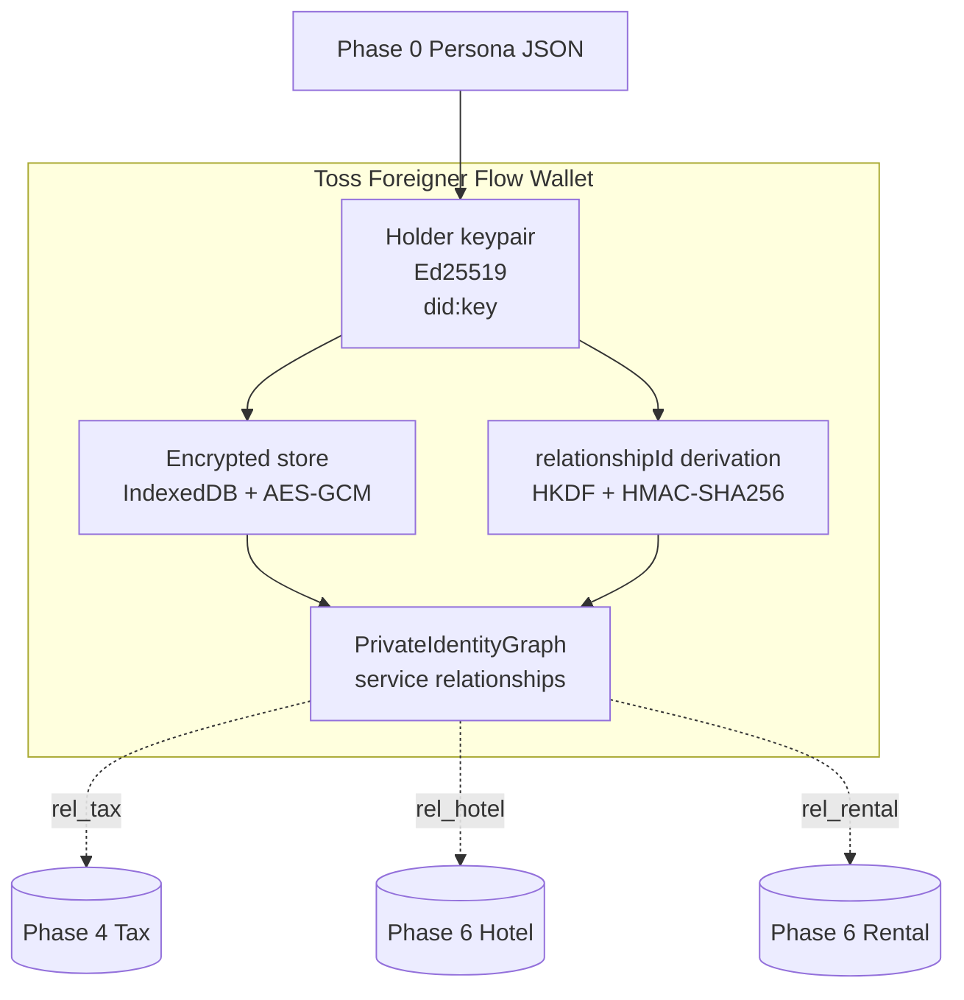

# Phase 2 — Toss 인앱 지갑 골격 (XRPL holder)

> **분류**: Required MVP · **시간**: 90분 · **사전 phase**: [P0](phase-0.md), [P1](phase-1.md)
> **다음 phase**: [Phase 3 — E0 anchor](phase-3.md)

## 한 줄 요약

사용자가 보는 토스 미니앱 스타일 화면 + 로컬 holder key (`did:key`) + 암호화
store + 비공개 identity graph를 만든다.

## 이 phase의 목표

페르소나 1명을 골라 진입하면 "여권 확인을 마쳤어요" 상태가 보이고, store
dump가 평문 PII를 가지지 않는다.

## 핵심 용어

[React](glossary.md#react) · [Vite](glossary.md#vite) · [IndexedDB](glossary.md#indexeddb) ·
[AES-256-GCM](glossary.md#aes-gcm) · [did:key](glossary.md#did-key) ·
[Pairwise ID](glossary.md#pairwise-id) · [relationshipId](glossary.md#relationship-id) ·
[HKDF](glossary.md#hkdf) · [HMAC](glossary.md#hmac)

## 다이어그램



> *같은 holder key에서 서비스 도메인마다 다른 relationshipId가 파생된다.*

## 지갑이 갖춰야 할 4가지

- ① holder keypair ([Ed25519](glossary.md#ed25519), Secure Enclave mock)
- ② encrypted wallet store (브라우저 [IndexedDB](glossary.md#indexeddb) + [AES-GCM](glossary.md#aes-gcm))
- ③ private identity graph (서비스 도메인별 relationship + credential)
- ④ relationshipId 파생 함수 ([HKDF](glossary.md#hkdf) + [HMAC](glossary.md#hmac))

## pairwise relationshipId가 왜 필요한가

같은 사용자가 세금환급, 호텔, 렌탈을 다 쓸 때 모든 서비스에 똑같은 ID를
보여주면 → 사업자끼리 정보를 합쳐 사용자 활동을 추적할 수 있습니다.

대신 verifierDid + serviceDomain 별로 다른 ID를 보여주면 → 서비스끼리는 같은
사람인지 알 수 없고, 같은 서비스 안에서만 여러 이벤트 묶기 가능.

> 관련 용어: [Pairwise ID](glossary.md#pairwise-id) · [relationshipId](glossary.md#relationship-id)

## 디자인 — Toss mini-app 흉내

- 미니앱 프레임 (top nav, list row, 하단 CTA, 카드, divider).
- Apps in Toss UX writing 가이드의 "해요체" 한국어. CTA는 "다음에 일어날
  일"을 명시.
- 진입 시 인터럽트 bottom sheet 금지. 첫 화면이 즉시 유용해야 함.

> 관련 용어: [Mini-app](glossary.md#mini-app) · [Apps in Toss](glossary.md#apps-in-toss)

## 코드로 보기

### relationshipId 파생 (TypeScript)

```ts
import { hkdf } from '@noble/hashes/hkdf';
import { hmac } from '@noble/hashes/hmac';
import { sha256 } from '@noble/hashes/sha2';
import { bytesToBase64Url } from './codec';

export function deriveRelationshipId(args: {
  holderMasterSecret: Uint8Array;
  verifierDid: string;
  serviceDomain: string;
  holderDid: string;
}): string {
  const info = new TextEncoder().encode(args.verifierDid + '|' + args.serviceDomain);
  const relationshipSecret = hkdf(sha256, args.holderMasterSecret, undefined, info, 32);
  const message = new TextEncoder().encode(
    `${args.serviceDomain}:${args.verifierDid}:${args.holderDid}`,
  );
  return bytesToBase64Url(hmac(sha256, relationshipSecret, message));
}
```

> 같은 verifierDid + serviceDomain 조합은 항상 같은 ID, 다른 조합은 항상 다른 ID.

### PrivateIdentityGraph (직렬화 형태)

```json
{
  "type": "PrivateIdentityGraph",
  "holderDid": "did:key:zHOLDER_CORE",
  "serviceRelationships": [
    {
      "serviceDomain": "tax_refund",
      "verifierDid": "did:xrpl:1:rREFUND_OPERATOR_CONNECTOR",
      "relationshipId": "rel_tax_2vBq9F7L8Qx3mZpT",
      "credentials": ["urn:vc:tax-refund-readiness:01J8TAX123"],
      "events": ["evt_taxrefund_01J8TXA"]
    }
  ]
}
```

## 검증 방법

- [ ] 진입 시 페르소나 picker 동작 → 1명 선택 → 홈 진입
- [ ] 홈 상단에 "여권 확인을 마쳤어요" 상태 row 노출
- [ ] devtools → IndexedDB dump → AES ciphertext만 보이고 평문 여권번호 없음
- [ ] 같은 페르소나로 두 번 환급 진입 시 relationshipId 동일
- [ ] 다른 페르소나로 진입 시 relationshipId 다름

## 자주 빠지는 함정

- `localStorage`에 평문 저장 → CSP/XSS로 즉시 유출
- verifierDid를 구분 없이 한 도메인에 묶기 → pairwise 가치 사라짐
- IndexedDB 키를 메모리에 영원히 들고 있기 → tab inactive 시 잊도록 lifecycle 관리
