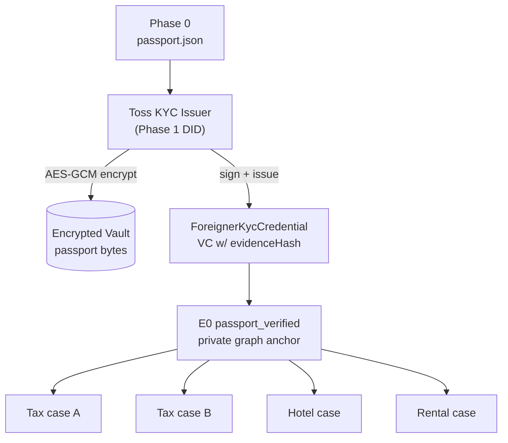

# Phase 3 — E0 여권 anchor & ForeignerKycCredential

> **분류**: Required MVP · **시간**: 60분 · **사전 phase**: [P0](phase-0.md), [P1](phase-1.md), [P2](phase-2.md)
> **다음 phase**: [Phase 4 — Tax-Refund Proof Chain](phase-4.md)

## 한 줄 요약

Phase 0의 mock 여권을 Phase 2 지갑에 흘려서 E0 (`passport_verified`)와
`ForeignerKycCredential`을 한 번만 발급한다. 모든 서비스 chain의 root.

## 이 phase의 목표

같은 페르소나로 두 번 환급해도 새 여권 event를 만들지 않고 E0를 재사용. DAG
가 [`docs/multi-service-e0-dag.mmd`](../docs/multi-service-e0-dag.mmd) 구조와
일치.

## 핵심 용어

[VC](glossary.md#vc) · [JSON-LD](glossary.md#json-ld) · [Issuer](glossary.md#issuer) ·
[Envelope Encryption](glossary.md#envelope-encryption) ·
[eventPayloadHash](glossary.md#event-payload-hash) · [attestorDid](glossary.md#attestor-did)

## 다이어그램



> *E0 한 번 발급 → 모든 서비스 case가 같은 root에서 분기.*

## 왜 "한 번만"인가

구매할 때마다 여권 검증 event를 새로 만들면 (1) UX가 매번 똑같은 단계 반복,
(2) chain에 같은 여권 hash가 여러 번 노출, (3) 사용자가 "내 여권이 자꾸 어디
보내지나" 불안.

대신 처음 한 번 E0 anchor를 만들고, 이후 모든 서비스 chain은 E0에서 branch.
여권 원본 자체는 암호화 vault에 한 번만.

> 관련 용어: [Envelope Encryption](glossary.md#envelope-encryption)

## ForeignerKycCredential 의 역할

Toss KYC issuer가 발급하는 VC 1장. credentialSubject 안에는 "passport
verified: yes / face match: yes / residence checked: yes" 같은 boolean claim.

여권번호·국적·생년월일 같은 raw 값은 VC에 직접 넣지 않음. `evidenceHash` +
URI로 암호화된 off-chain envelope만 가리킴.

> 관련 용어: [VC](glossary.md#vc) · [Issuer](glossary.md#issuer)

## E0 event envelope 구조

- `eventType` = `passport_verified`
- `attestorDid` = `did:xrpl:1:rTOSS_KYC_ISSUER`
- `eventPayloadHash` = SHA-256(canonicalize(여권 검증 결과 payload))
- `previousEventHash` = `null` (chain의 시작점)
- `proof` = Ed25519 서명 by issuer

> 관련 용어: [attestorDid](glossary.md#attestor-did) ·
> [eventPayloadHash](glossary.md#event-payload-hash) ·
> [SHA-256](glossary.md#sha-256) · [Ed25519](glossary.md#ed25519)

## 코드로 보기

### `ForeignerKycCredential` (요약)

```json
{
  "@context": ["https://www.w3.org/ns/credentials/v2"],
  "id": "urn:vc:foreigner-kyc:01J8KYC",
  "type": ["VerifiableCredential", "ForeignerKycCredential"],
  "issuer": "did:xrpl:1:rTOSS_KYC_ISSUER",
  "validFrom": "2026-05-01T00:00:00Z",
  "validUntil": "2026-12-31T23:59:59Z",
  "credentialSubject": {
    "id": "did:key:zHOLDER_CORE",
    "claims": {
      "passportVerified": true,
      "faceMatchVerified": true,
      "residenceChecked": true,
      "jurisdiction": "KR"
    }
  },
  "evidence": {
    "type": "IssuerInternalEvidence",
    "evidenceRef": "offrec_kyc_01J8...",
    "evidenceHash": "sha256:c40e0f...",
    "accessPolicy": "issuer-only-unless-holder-grants"
  },
  "proof": {
    "type": "DataIntegrityProof",
    "verificationMethod": "did:xrpl:1:rTOSS_KYC_ISSUER#key-1",
    "proofPurpose": "assertionMethod",
    "proofValue": "z..."
  }
}
```

## 검증 방법

- [ ] 첫 환급 시도 → E0 + VC 1장 발급, vault에 암호화 envelope 1개 저장
- [ ] 두 번째 환급 시도 → E0 재사용, 새 VC 발급 없음
- [ ] VC payload에 평문 여권번호 / 국적 / 생년월일 없음
- [ ] vault dump → AES ciphertext + 빈 plaintext 확인

## 자주 빠지는 함정

- VC에 raw 여권번호 직접 넣기 → public lookup 시 PII 유출
- E0를 매번 새로 발급 → DAG가 forest로 변해 재사용 가치 0
- `evidenceHash` 검증 안 함 → vault 변조 탐지 불가
