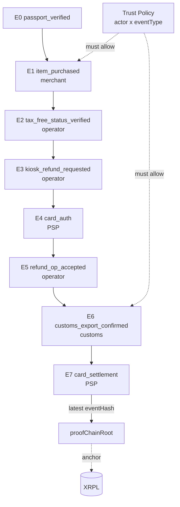

# Phase 4 — 세금환급 Proof Chain (Required MVP · 영상 본편)

> **분류**: Required MVP · **시간**: 180분 · **사전 phase**: [P0](phase-0.md), [P1](phase-1.md), [P2](phase-2.md), [P3](phase-3.md)
> **다음 phase**: [Phase 5 — Presentation Exchange](phase-5.md)

## 한 줄 요약

E0 → E7 hash-linked chain을 동작시키고 3-pane 데모 화면 (phone | kiosk | XRPL
inspector)을 완성. 해커톤 영상의 핵심.

## 이 phase의 목표

[`docs/mvp-video-demo-plan.md`](../docs/mvp-video-demo-plan.md)의 9개
Acceptance Criteria를 모두 만족시킨다. 영상 그대로 reproduce 가능.

## 핵심 용어

[Proof Chain](glossary.md#proof-chain) ·
[proofChainRoot](glossary.md#proof-chain-root) ·
[previousEventHash](glossary.md#previous-event-hash) ·
[eventPayloadHash](glossary.md#event-payload-hash) ·
[Trust Policy](glossary.md#trust-policy) ·
[Trust Registry](glossary.md#trust-registry) ·
[attestorDid](glossary.md#attestor-did) ·
[Canonical JSON](glossary.md#canonical-json)

## 다이어그램



> *7개 event가 hash로 연결되고 마지막 root만 XRPL에 anchor.*

## E1 ~ E7 — 누가 무엇을 서명하나

- E1 `item_purchased` — merchant POS 가 서명
- E2 `tax_free_status_verified` — refund operator 가 서명
- E3 `kiosk_refund_requested` — refund operator 가 서명
- E4 `card_authorization_verified` — card PSP 가 서명
- E5 `refund_operator_accepted` — refund operator 가 서명
- E6 `customs_export_confirmed` — customs connector 가 서명
- E7 `card_settlement_completed` — card PSP 가 서명

> 관련 용어: [POS](glossary.md#pos) · [환급창구운영사업자](glossary.md#refund-operator) · [PSP](glossary.md#psp)

## 검증 5단계 (모든 event마다)

1. **signature**: `attestorDid`에서 공개키를 가져와 Ed25519 서명 검증
2. **trust policy**: 이 actor가 이 eventType에 서명할 권한이 있나
3. **previousEventHash**: 이전 event hash와 정확히 일치하나
4. **eventPayloadHash**: 본문이 변조되지 않았나
5. **proofChainRoot**: 마지막 event hash가 XRPL에 anchor된 값과 같나

> 관련 용어: [Trust Policy](glossary.md#trust-policy) ·
> [previousEventHash](glossary.md#previous-event-hash) ·
> [eventPayloadHash](glossary.md#event-payload-hash) ·
> [proofChainRoot](glossary.md#proof-chain-root)

## Forged Signer 데모 — 영상의 강력한 한 컷

"잘못된 서명 넣어보기" 버튼: merchant 키가 `customs_export_confirmed` event를
서명.

결과: signature는 Ed25519 검증을 통과 (키 자체는 valid), 그러나 trust policy가
reject ("merchant는 customs event를 서명할 수 없음").

메시지: **"서명만 valid해도 권한이 없으면 거부됩니다."** → 시스템이 양쪽을 다
보고 있다는 가장 명확한 증거.

> 관련 용어: [Trust Policy](glossary.md#trust-policy) · [Trust Registry](glossary.md#trust-registry)

## 코드로 보기

### Trust policy 예시

```ts
export const trustPolicy: Record<string, string[]> = {
  passport_verified: ['did:xrpl:1:rTOSS_KYC_ISSUER'],
  item_purchased: ['did:xrpl:1:rMERCHANT_POS_CONNECTOR'],
  tax_free_status_verified: ['did:xrpl:1:rREFUND_OPERATOR_CONNECTOR'],
  kiosk_refund_requested: ['did:xrpl:1:rREFUND_OPERATOR_CONNECTOR'],
  card_authorization_verified: ['did:xrpl:1:rCARD_PSP_CONNECTOR'],
  refund_operator_accepted: ['did:xrpl:1:rREFUND_OPERATOR_CONNECTOR'],
  customs_export_confirmed: ['did:xrpl:1:rCUSTOMS_CONNECTOR'],
  card_settlement_completed: ['did:xrpl:1:rCARD_PSP_CONNECTOR'],
};

export function isAuthorized(eventType: string, signerDid: string): boolean {
  return trustPolicy[eventType]?.includes(signerDid) ?? false;
}
```

### event envelope (서명 전)

```json
{
  "eventId": "evt_taxrefund_01J8TXA_004",
  "eventType": "refund_operator_accepted",
  "attestorDid": "did:xrpl:1:rREFUND_OPERATOR_CONNECTOR",
  "occurredAt": "2026-05-02T05:30:00Z",
  "previousEventHash": "sha256:abc123...",
  "eventPayloadHash": "sha256:def456...",
  "offchainRecordRef": "offrec_tax_claim_01J8TXA"
}
```

> 이 envelope을 canonical JSON으로 직렬화 → SHA-256 → Ed25519 서명.

## 검증 방법

- [ ] 7개 event 모두 signature/trust/hash chain/anchor 4단 검증 통과
- [ ] "잘못된 서명" 버튼 → trust policy reject UI 노출
- [ ] 3-pane 동시 동기화 (phone 액션 → kiosk 갱신 → inspector 새 hash)
- [ ] XRPL inspector에 user DID / event type / 영수증 detail 전혀 안 보임
- [ ] 한국어 카피 모두 "해요체" + CTA에 "다음 행동" 명시

## 자주 빠지는 함정

- `JSON.stringify` 그대로 hash → 키 순서 다르면 hash 다름. canonical JSON 필수.
- trust policy 검증 잊고 signature만 검증 → rogue vendor 통과
- XRPL anchor에 user DID나 eventType 같이 올림 → privacy 무너짐

## 원본 문서 참조

- [`docs/privacy-preserving-proof-chain.mmd`](../docs/privacy-preserving-proof-chain.mmd)
- [`docs/mvp-video-demo-plan.md`](../docs/mvp-video-demo-plan.md)
