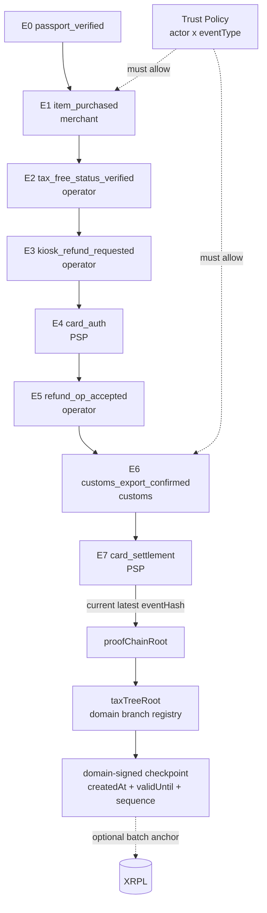

# Phase 4 — 세금환급 Proof Chain (Required MVP · 영상 본편)

> **분류**: Required MVP · **시간**: 180분 · **사전 phase**: [P0](phase-0.md), [P1](phase-1.md), [P2](phase-2.md), [P3](phase-3.md)
> **다음 phase**: [Phase 5 — Presentation Exchange](phase-5.md)

## 한 줄 요약

E0 → E7 hash-linked chain을 동작시키고 3-pane 데모 화면 (phone | kiosk | XRPL
inspector)을 완성. 해커톤 영상의 핵심.

## 이 phase의 목표

[`docs/mvp-video-demo-plan.md`](../docs/mvp-video-demo-plan.md)의 9개
Acceptance Criteria를 모두 만족시킨다. 영상 그대로 reproduce 가능.

## 핵심 용어

[Proof Chain](glossary.md#proof-chain) ·
[proofChainRoot](glossary.md#proof-chain-root) ·
[previousEventHash](glossary.md#previous-event-hash) ·
[eventPayloadHash](glossary.md#event-payload-hash) ·
[Trust Policy](glossary.md#trust-policy) ·
[Trust Registry](glossary.md#trust-registry) ·
[attestorDid](glossary.md#attestor-did) ·
[Canonical JSON](glossary.md#canonical-json)

## 다이어그램



> *7개 event가 hash로 연결되고 root checkpoint는 wallet에 저장된다. XRPL에는 production
> per-user write를 만들지 않고, 필요할 때만 여러 root를 묶은 batch commitment를 anchor.*

## E1 ~ E7 — 누가 무엇을 서명하나

- E1 `item_purchased` — merchant POS 가 서명
- E2 `tax_free_status_verified` — refund operator 가 서명
- E3 `kiosk_refund_requested` — refund operator 가 서명
- E4 `card_authorization_verified` — card PSP 가 서명
- E5 `refund_operator_accepted` — refund operator 가 서명
- E6 `customs_export_confirmed` — customs connector 가 서명
- E7 `card_settlement_completed` — card PSP 가 서명

> 관련 용어: [POS](glossary.md#pos) · [환급창구운영사업자](glossary.md#refund-operator) · [PSP](glossary.md#psp)

## 검증 6단계 (모든 event마다)

1. **signature**: `attestorDid`에서 공개키를 가져와 Ed25519 서명 검증
2. **trust policy**: 이 actor가 이 eventType에 서명할 권한이 있나
3. **previousEventHash**: 이전 event hash와 정확히 일치하나
4. **eventPayloadHash**: 본문이 변조되지 않았나
5. **proofChainRoot**: 마지막 event hash가 wallet의 signed checkpoint와 같나
6. **treeRoot / freshness**: 공개한 branch가 domain tree에 포함되고 checkpoint가
   `createdAt` / `validUntil` / `checkpointSequence` 기준으로 최신인가

> 관련 용어: [Trust Policy](glossary.md#trust-policy) ·
> [previousEventHash](glossary.md#previous-event-hash) ·
> [eventPayloadHash](glossary.md#event-payload-hash) ·
> [proofChainRoot](glossary.md#proof-chain-root)

## Forged Signer 데모 — 영상의 강력한 한 컷

"잘못된 서명 넣어보기" 버튼: merchant 키가 `customs_export_confirmed` event를
서명.

결과: signature는 Ed25519 검증을 통과 (키 자체는 valid), 그러나 trust policy가
reject ("merchant는 customs event를 서명할 수 없음").

메시지: **"서명만 valid해도 권한이 없으면 거부됩니다."** → 시스템이 양쪽을 다
보고 있다는 가장 명확한 증거.

> 관련 용어: [Trust Policy](glossary.md#trust-policy) · [Trust Registry](glossary.md#trust-registry)

## 코드로 보기

### Trust policy 예시

```ts
export const trustPolicy: Record<string, string[]> = {
  passport_verified: ['did:xrpl:1:rTOSS_KYC_ISSUER'],
  item_purchased: ['did:xrpl:1:rMERCHANT_POS_CONNECTOR'],
  tax_free_status_verified: ['did:xrpl:1:rREFUND_OPERATOR_CONNECTOR'],
  kiosk_refund_requested: ['did:xrpl:1:rREFUND_OPERATOR_CONNECTOR'],
  card_authorization_verified: ['did:xrpl:1:rCARD_PSP_CONNECTOR'],
  refund_operator_accepted: ['did:xrpl:1:rREFUND_OPERATOR_CONNECTOR'],
  customs_export_confirmed: ['did:xrpl:1:rCUSTOMS_CONNECTOR'],
  card_settlement_completed: ['did:xrpl:1:rCARD_PSP_CONNECTOR'],
};

export function isAuthorized(eventType: string, signerDid: string): boolean {
  return trustPolicy[eventType]?.includes(signerDid) ?? false;
}
```

### event envelope (서명 전)

```json
{
  "eventId": "evt_taxrefund_01J8TXA_004",
  "eventType": "refund_operator_accepted",
  "attestorDid": "did:xrpl:1:rREFUND_OPERATOR_CONNECTOR",
  "occurredAt": "2026-05-02T05:30:00Z",
  "signedAt": "2026-05-02T05:30:03Z",
  "previousEventHash": "sha256:abc123...",
  "eventPayloadHash": "sha256:def456...",
  "offchainRecordRef": "offrec_tax_claim_01J8TXA"
}
```

> 이 envelope을 canonical JSON으로 직렬화 → SHA-256 → Ed25519 서명.

### domain-signed root checkpoint

`proofChainRoot`는 완료된 E7만 뜻하지 않습니다. 현재 공개/검증하려는 branch의
latest event hash입니다. 예를 들어 E3까지만 진행된 거래라면
`proofChainRoot = hash(E3)`이고, E7까지 끝난 거래라면 `proofChainRoot = hash(E7)`입니다.
마지막 event를 바꾼 actor는 그 event envelope에 `signedAt`을 넣어 서명합니다.
따라서 branch tip의 행위자 증명은 "root 서명"이 아니라 최신 event 서명으로 확인합니다.

`proofChainRoot` 하나만 검증하면 한 branch의 변조만 알 수 있습니다. branch 전체를
삭제하거나, 별도 branch를 새로 만들어 숨기는 문제는 잡기 어렵습니다. 그래서 wallet은
case별 `proofChainRoot`를 다시 service-domain tree에 넣고, 그 domain `treeRoot`를
domain checkpoint signer가 서명한 checkpoint로 저장합니다. 이 signer는 보통 현재
latest event signer가 됩니다. 다만 그 actor가 domain tree와 이전 checkpoint를 검증할 수
있어야 하므로, flow에 따라 refund operator 같은 domain coordinator가 대신 서명할 수
있습니다.

Wallet holder key는 presentation/consent를 서명합니다. Holder signature만으로는 branch
삭제나 swap을 막을 수 없으므로, tamper-resistant checkpoint에는 domain actor 서명,
`previousCheckpointHash`, `checkpointSequence`, freshness window가 필요합니다. Wallet 내부에는
여러 domain root를 묶은 private global root를 둘 수 있지만, verifier에게 기본 공개하지 않습니다.

```json
{
  "type": "DomainRootCheckpoint",
  "relationshipId": "rel_tax_2vBq9F7L8Qx3mZpT",
  "serviceDomain": "tax_refund",
  "treeRoot": "sha256:domain-tree-root",
  "branchId": "branch_taxrefund_01J8TXA",
  "currentEventHash": "sha256:event-e3",
  "currentEventType": "kiosk_refund_requested",
  "proofChainRoot": "sha256:event-e3",
  "statusRoot": "sha256:status-list-root",
  "previousCheckpointHash": "sha256:checkpoint-16",
  "checkpointSequence": 17,
  "createdAt": "2026-05-02T05:40:00Z",
  "validUntil": "2026-05-02T06:10:00Z",
  "latestEventSignerDid": "did:xrpl:1:rREFUND_OPERATOR_CONNECTOR",
  "checkpointSignerDid": "did:xrpl:1:rREFUND_OPERATOR_CONNECTOR",
  "proof": {
    "type": "DataIntegrityProof",
    "verificationMethod": "did:xrpl:1:rREFUND_OPERATOR_CONNECTOR#key-1",
    "proofPurpose": "assertionMethod",
    "proofValue": "z..."
  }
}
```

검증자는 `branchId`의 Merkle inclusion proof를 확인해 이 tax refund branch가
`treeRoot`에 포함됐는지 봅니다. whole-tree 검증이 필요한 거래에서는 wallet이 공개한
단일 branch만 믿지 않고, `treeRoot` + branch inclusion proof + signed checkpoint를
함께 요구합니다. 여기서 "whole-tree"는 전체 wallet tree가 아니라 해당 service-domain
tree입니다.

`createdAt` / `signedAt`만으로는 rollback을 완전히 막지 못합니다. POS/Toss/refund operator는
자기 서버 DB에 pairwise `relationshipId` 기준으로 마지막 `checkpointSequence`와
`seenAt`을 저장하고, 더 오래된 checkpoint가 다시 오면 거부해야 합니다. 이 last-seen
내역을 checkpoint 안에 넣어 모든 verifier에게 보여주면 활동 이력이 노출되므로 금지합니다.
전역 wallet ID도 여러 서비스 활동을 연결할 수 있으므로 쓰지 않습니다.

## 검증 방법

- [ ] 7개 event 모두 signature/trust/hash chain/checkpoint/treeRoot 검증 통과
- [ ] branch 삭제 또는 다른 branch로 swap 시도 → domain-signed treeRoot / previousCheckpointHash / checkpointSequence reject
- [ ] "잘못된 서명" 버튼 → trust policy reject UI 노출
- [ ] 3-pane 동시 동기화 (phone 액션 → kiosk 갱신 → inspector 새 hash)
- [ ] XRPL inspector에 user DID / event type / 영수증 detail 전혀 안 보임
- [ ] 한국어 카피 모두 "해요체" + CTA에 "다음 행동" 명시

## 자주 빠지는 함정

- `JSON.stringify` 그대로 hash → 키 순서 다르면 hash 다름. canonical JSON 필수.
- trust policy 검증 잊고 signature만 검증 → rogue vendor 통과
- root checkpoint를 domain actor 서명 없이 wallet holder 서명만으로 저장 → wallet owner가 branch 삭제/swap 가능
- `createdAt` / `signedAt`만 믿고 `checkpointSequence` / last-seen 검증 생략 → 오래된 valid checkpoint rollback 가능
- XRPL anchor에 user DID나 eventType 같이 올림 → privacy 무너짐

## 원본 문서 참조

- [`docs/privacy-preserving-proof-chain.mmd`](../docs/privacy-preserving-proof-chain.mmd)
- [`docs/mvp-video-demo-plan.md`](../docs/mvp-video-demo-plan.md)
