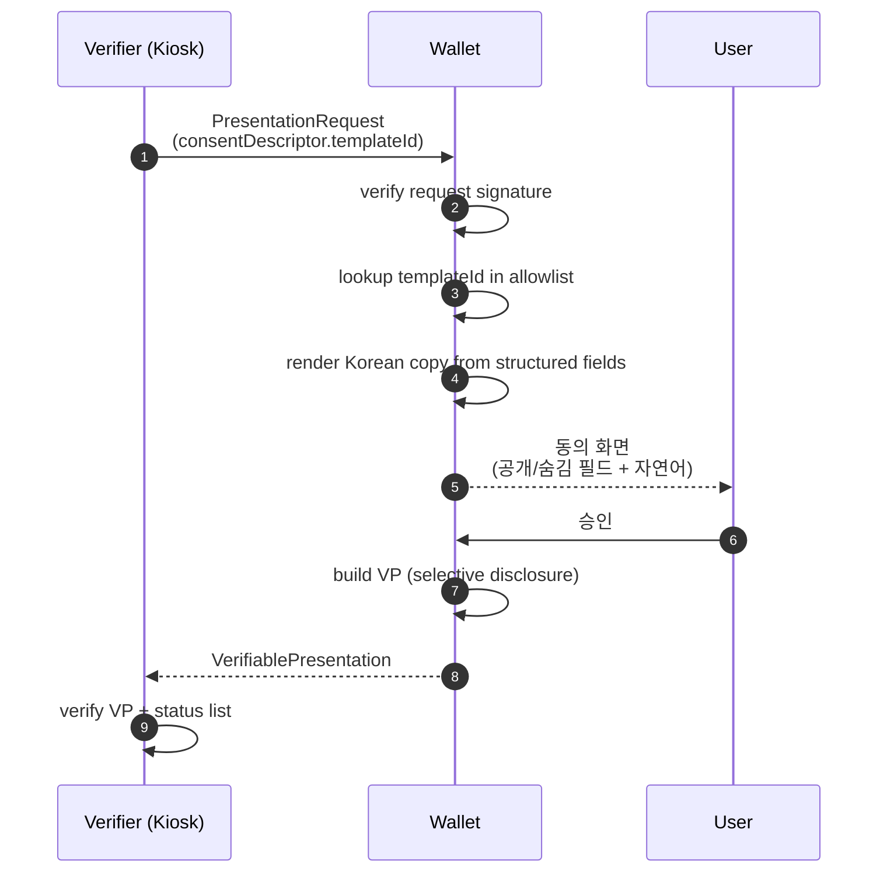

# Phase 5 — Presentation Exchange & 동의 화면

> **분류**: Required MVP · **시간**: 60분 · **사전 phase**: [P3](phase-3.md), [P4](phase-4.md)
> **다음 phase**: [Phase 6 — 호텔 / 렌탈 / 보증금](phase-6.md)

## 한 줄 요약

키오스크/operator가 wallet에 scoped presentation request를 보내고, wallet은
vendor 텍스트가 아닌 allowlisted template으로 한국어 동의 문장을 렌더링한다.

## 이 phase의 목표

3개 템플릿(tax/hotel/rental)을 wired up하고, vendor가 임의 문구를 보내도
UI에는 절대 그 문구가 나오지 않음을 단위 테스트로 증명.

## 핵심 용어

[Consent Descriptor](glossary.md#consent-descriptor) ·
[Allowlist Template](glossary.md#allowlist-template) ·
[VP](glossary.md#vp) · [Verifier](glossary.md#verifier) ·
[Selective disclosure](glossary.md#selective-disclosure) ·
[Holder Access Grant](glossary.md#access-grant)

## 다이어그램



> *신뢰 가능한 template에서만 카피 생성, vendor는 raw text를 inject할 수 없음.*

## 왜 vendor 문구를 그대로 쓰면 안 되나

vendor가 "환급을 위해 모든 정보를 확인합니다" 같은 misleading 문구를 보내고
사용자가 무심코 confirm 누르면 → over-share.

대신 wallet이 신뢰하는 `templateId`만 인정. structured fields (purpose,
requesterDisplayName, requestedSummaryFields, retention)를 받아 자기 카피 룰로
자연어 문장 만듦.

> 관련 용어: [Allowlist Template](glossary.md#allowlist-template) ·
> [Consent Descriptor](glossary.md#consent-descriptor)

## 3개 템플릿

- `tax_refund_kiosk_verify` → "환급을 위해 여권 확인 여부와 면세 구매 증명을 확인할게요"
- `hotel_stay_history` → "{hotelName}에서 {nights}일 동안 머문 내역을 확인할게요"
- `rental_deposit_check` → "렌터카 보증금 처리를 위해 면허 확인 여부와 보증금 상태를 확인할게요"

## 동의 화면에 반드시 표시

- 공개되는 필드 목록 (yes/no claim 위주)
- 숨겨지는 필드 목록 (passport number, ARC 등)
- requester의 DID + display name
- 보관 기간 (`session_only` / 30일 등)
- 취소·뒤로 가기 path가 명확

> 관련 용어: [Selective disclosure](glossary.md#selective-disclosure)

## 코드로 보기

### `PresentationRequest` 예시

```json
{
  "type": "PresentationRequest",
  "verifierDid": "did:xrpl:1:rREFUND_OPERATOR_CONNECTOR",
  "purpose": "tax_refund_processing",
  "requestedClaims": ["passportProofVerified", "refundSlipPresent"],
  "consentDescriptor": {
    "templateId": "tax_refund_kiosk_verify_v1",
    "locale": "ko-KR",
    "requesterDisplayName": "인천공항 환급 키오스크",
    "requestedSummaryFields": ["여권 확인 여부", "면세 구매 증명"],
    "withheldSummaryFields": ["여권 원본 정보", "카드 인증 원문"],
    "retention": "session_only"
  },
  "forbiddenClaims": ["passportNumber", "nationality", "arcNumber"],
  "challenge": "verifier_nonce_abc123",
  "domain": "tax-refund.toss.example"
}
```

### Allowlist renderer (TypeScript)

```ts
const TEMPLATES: Record<string, (d: ConsentDescriptor) => string> = {
  tax_refund_kiosk_verify_v1: () =>
    '환급을 위해 여권 확인 여부와 면세 구매 증명을 확인할게요',
  hotel_stay_history_v1: (d) =>
    `${d.variables.hotelName}에서 ${d.variables.nights}일 동안 머문 내역을 확인할게요`,
  rental_deposit_check_v1: () =>
    '렌터카 보증금 처리를 위해 면허 확인 여부와 보증금 상태를 확인할게요',
};

export function renderConsentCopy(d: ConsentDescriptor): string {
  const renderer = TEMPLATES[d.templateId];
  if (!renderer) throw new Error('Unknown templateId — refused');
  return renderer(d);
}
```

## 검증 방법

- [ ] 3개 템플릿 모두 동의 화면 정상 렌더링
- [ ] unit test: 임의 vendor 문구 inject → UI에 절대 노출되지 않음
- [ ] 동의 details view에 공개/숨김 필드 모두 노출
- [ ] requester DID 검증 실패 시 동의 화면 자체가 뜨지 않음
