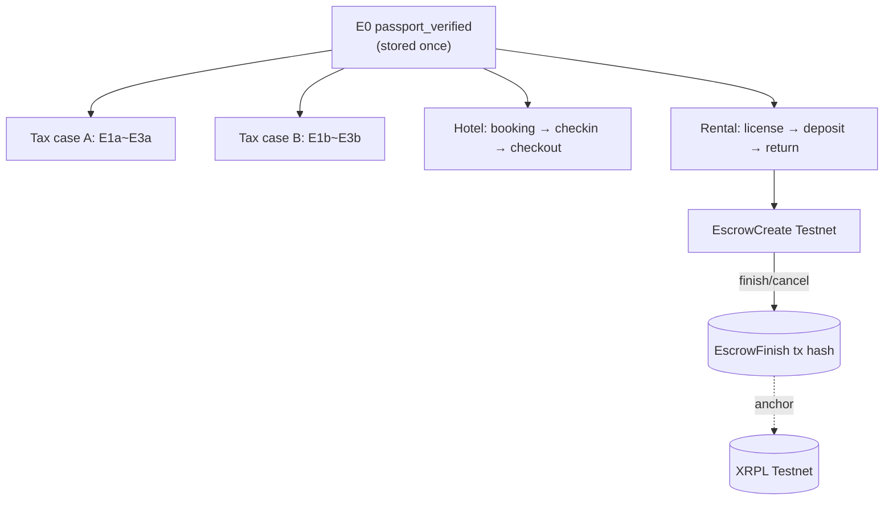

# Phase 6 — 호텔 / 렌탈 / 보증금 분기

> **분류**: Should + Nice · **시간**: 120분 · **사전 phase**: [P3](phase-3.md), [P5](phase-5.md)
> **다음 phase**: [Phase 7 — 백업·복구·영상·IR](phase-7.md)

## 한 줄 요약

MVP 영상 9번 컷 "호텔/렌터카에도 쓸 수 있어요"의 실체. 같은 E0를 재사용해
hotel/rental relationship을 새로 파생.

## 이 phase의 목표

hotel + rental + 1개 escrow demo로
[`docs/multi-service-e0-dag.mmd`](../docs/multi-service-e0-dag.mmd) 모양과
정확히 일치하는 DAG를 만든다.

## 핵심 용어

[VC](glossary.md#vc) · [EscrowCreate / EscrowFinish](glossary.md#escrow-create) ·
[Pairwise ID](glossary.md#pairwise-id) · [RLUSD](glossary.md#rlusd)

## 다이어그램

## 구현 순서 — 차량 렌탈로 고정

[`docs/ko/plan.ko.md`](../docs/ko/plan.ko.md) §11.4 열린 결정사항 중 "차량
렌탈" 선택. 부동산 렌탈은 demo가 너무 복잡.

- ① **Hotel**: `HotelGuestStatusCredential` + 체크인/체크아웃 receipt 1세트
- ② **Rental**: `LicenseVerificationCredential` + `RentalEligibilityCredential`
- ③ **Escrow**: XRPL Testnet `EscrowCreate` → `EscrowFinish`, tx hash만 inspector에 노출

> 관련 용어: [VC](glossary.md#vc) · [EscrowCreate](glossary.md#escrow-create)

## E0 재사용 검증

- 같은 페르소나로 hotel 진입 → 새 holder DID/VC가 안 만들어지고 E0를 재참조
- 새 `relationshipId`가 derive (`rel_hotel_*`)
- DAG가 [`multi-service-e0-dag.mmd`](../docs/multi-service-e0-dag.mmd) 모양과
  일치 — E0가 root, 4개 case가 branch

> 관련 용어: [Pairwise ID](glossary.md#pairwise-id)

## 에스크로의 역할

호텔/렌탈 보증금을 XRPL Testnet의 native escrow로 시연. 조건이 맞으면 자동
release, 아니면 cancel.

XRPL 외 다른 체인을 쓰지 않아도 되는 한 가지 강력한 이유. (현실에서는 인허가
partner rail 필요)

## 검증 방법

- [ ] hotel 분기에서 E0 재참조 (devtools에서 확인)
- [ ] `rel_hotel != rel_tax != rel_rental` (모두 다른 ID)
- [ ] Testnet escrow tx hash 1개를 explorer로 검증
- [ ] 모든 분기가 동일 페르소나에서 시작

## 자주 빠지는 함정

- hotel/rental마다 새 KYC 화면 띄우기 → E0 재사용 가치 0
- 실제 보증금 금액을 mainnet에 보내기 → 절대 금지
